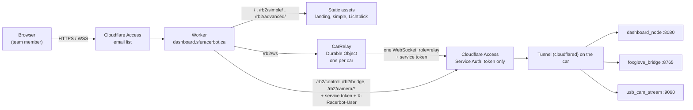

# SFU Racerbot web dashboards

> **Who this is for:** anyone on the team who wants to watch or tune a car from a browser, or change the site that makes that possible. No robotics or Cloudflare experience assumed.
> **Read first:** nothing. For the car itself, start at the car repo's [README](https://github.com/sfu-racerbot/Racerbot-Car-2-Workspace).
> **What's in it:** what the site is, its two dashboards, how a request reaches the car, and how to run all of it on your laptop with no car.

The team's F1TENTH/Roboracer cars can be watched and tuned from **https://dashboard.sfuracerbot.ca**, in any browser, from anywhere, with nothing to install. You log in with your team email; the page lists each car with a live "online / N watching" light and links to its two dashboards.

## Highlights

- **Two dashboards, one address.** **Simple** is the team's own HUD (map, LiDAR, pose, drive intent, camera, live tuning), and works on a phone. **Advanced** is [Lichtblick](https://github.com/lichtblick-suite/lichtblick), with every ROS 2 topic, service and parameter, in Chrome or Edge.
- **Any number of viewers for the price of one.** A relay per car holds a single connection to the car and fans each message out to everyone watching. Measured with the mock: two tabs, one car connection, identical maps.
- **Writes are per person and time out.** Watching uses the shared relay, which refuses writes. Tuning, stopping a process or deleting a map opens the viewer's own control link, which closes after 5 idle minutes or when the tab is hidden — and closing it disarms tuning.
- **Nothing runs while nobody watches.** The relay drops the car connection 60 s after the last viewer leaves and goes to sleep.
- **Only the team gets in, and only the site reaches the car.** Cloudflare Access admits a list of emails; the car's tunnel hostnames admit one service token, held by the site. See [docs/security.md](docs/security.md).
- **Honest limits:** the Workers Free plan allows about 13 hours of watching a day in total ([docs/costs.md](docs/costs.md)); "car online" is only known while someone is watching; and Lichtblick needs Chrome or Edge.

### Why it exists

The simple dashboard used to be served by the car itself, at `http://<car-ip>:8080`, reachable only on the same WiFi or over Tailscale, with no login. Every browser that opened it added another full telemetry stream to the car's uplink. This site puts both dashboards behind one login-protected address, sends the car's stream once however many people watch, and makes the frontend something the team can deploy without touching the car.

## How a request reaches the car



In words:

1. **Access** checks you are on the team's email list. Nothing below runs for anyone else.
2. **The Worker** serves the pages, and for each car:
   - `/<car>/ws` goes to that car's **relay** (a Durable Object: a small program with its own memory that Cloudflare runs as exactly one copy per car). The relay holds one connection to the car and sends every viewer the same stream.
   - `/<car>/control`, `/<car>/bridge` and `/<car>/camera/…` are passed straight through to the car, one connection per browser.
3. Every request to the car carries the site's **service token**. The car's tunnel hostnames accept nothing else.
4. **The tunnel** (`cloudflared`, running on the car) delivers each request to the right program on the car.

## What's in this repo

| Path | What it is |
|---|---|
| [`apps/landing/`](apps/landing/) | The page at `/`: the car list and status |
| [`apps/simple/`](apps/simple/) | The simple dashboard. Plain HTML/JS/CSS, no build step. Imported from the car repo with its history — see [`apps/simple/SOURCE.md`](apps/simple/SOURCE.md) |
| [`apps/advanced/`](apps/advanced/) | The pinned Lichtblick version, its build script, and the team's default layout |
| [`worker/`](worker/) | The Worker and the `CarRelay` Durable Object (TypeScript), with unit tests |
| [`tools/mock-car/`](tools/mock-car/) | A pretend car for local development |
| [`scripts/assemble.mjs`](scripts/assemble.mjs) | Builds `dist/`, the files Cloudflare serves, and checks them against the size limits |
| [`wrangler.jsonc`](wrangler.jsonc) | Cloudflare config, including **the list of cars** (`CARS`) |
| [`docs/`](docs/) | Everything else — see the table at the end |

## Local development, with no car

You need Node 22. Everything runs on your laptop: the Worker and relay in `wrangler dev`, the car in the mock.

**Run these in order.** All from the repo root.

**Terminal 1** — install, once:

```bash
npm ci
cp .dev.vars.example .dev.vars
```

**Working when:** `npm ci` ends without errors.

**Terminal 1** — the pretend car. Leave it running.

```bash
npm run mock
```

**Working when:** it prints `dashboard_node on ws://localhost:8080/ws…`, then a `[rates]` line every 5 s.

**Terminal 2** — the site.

```bash
npm run dev
```

**Working when:** it prints `Ready on http://localhost:8787`. Open http://localhost:8787 and choose **Simple**: the map draws as the pretend car drives, and the link row reads `CAR ONLINE · 1 WATCHING`.

**If it doesn't:** see [`tools/mock-car/README.md`](tools/mock-car/README.md) for what to expect and what each message means.

**Advanced locally** needs Lichtblick built first (`apps/advanced/build.sh`, a few minutes, about 4 GB). Without it, `/rb2/advanced/` says so. The mock has no `foxglove_bridge`, so Lichtblick will say it cannot connect.

## Tests

**Terminal 1**, from the repo root:

```bash
npm test
```

**Working when:** every part passes — the simple dashboard's 9 test files (`all 9 test files passed`), the Worker's vitest suite, the mock car's `node:test` suite (`# fail 0`), and the TypeScript typecheck.

| Suite | What it covers |
|---|---|
| `npm run test:simple` | The dashboard's browser code under plain node, including every structural check ported from the car repo, and the new control-link and protocol checks |
| `npm run test:worker` | Routing, car config, header rewriting (including stripping browser-supplied `X-Racerbot-*`), the relay's framing and late-joiner cache |
| `npm run test:mock` | That the mock car keeps the car contract |
| `npm run typecheck` | The Worker's TypeScript |

## Deploying

Merging to `main` deploys, through GitHub Actions ([`.github/workflows/ci.yml`](.github/workflows/ci.yml)). Every pull request runs the tests, builds Lichtblick from source, checks the asset limits and does a dry-run deploy.

The one-time Cloudflare setup — Access, the service token, the tunnel routes, secrets — is done by a person in the Cloudflare dashboard: **[docs/cloudflare-setup.md](docs/cloudflare-setup.md)**.

**Adding a car** is one entry in `CARS` in `wrangler.jsonc`, plus its tunnel and Access setup ([how](docs/cloudflare-setup.md#adding-a-car)).

## Docs

| Doc | Read it when |
|---|---|
| [docs/cloudflare-setup.md](docs/cloudflare-setup.md) | Setting the site up, adding a car, or giving someone access |
| [docs/decisions.md](docs/decisions.md) | You want to know why something is built the way it is, and what was checked |
| [docs/costs.md](docs/costs.md) | You want to know what running it costs and how many hours the free plan allows |
| [docs/security.md](docs/security.md) | You are changing Access, the Worker's headers, or what the car trusts |
| [docs/follow-ups.md](docs/follow-ups.md) | You are looking for the next thing to work on |
| [apps/advanced/README.md](apps/advanced/README.md) | Upgrading Lichtblick or changing its default layout |
| [tools/mock-car/README.md](tools/mock-car/README.md) | Developing without a car |
| [apps/simple/SOURCE.md](apps/simple/SOURCE.md) | Comparing the simple dashboard with its car-repo ancestor |

## License

This repo's own code: MIT. Lichtblick is MPL-2.0 and is built from its unmodified source at the pinned tag.
