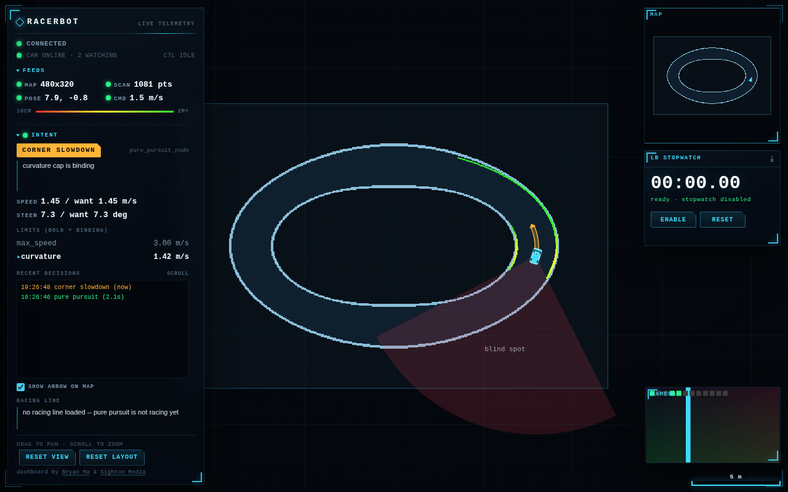
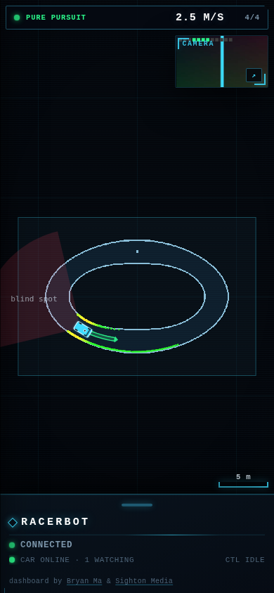
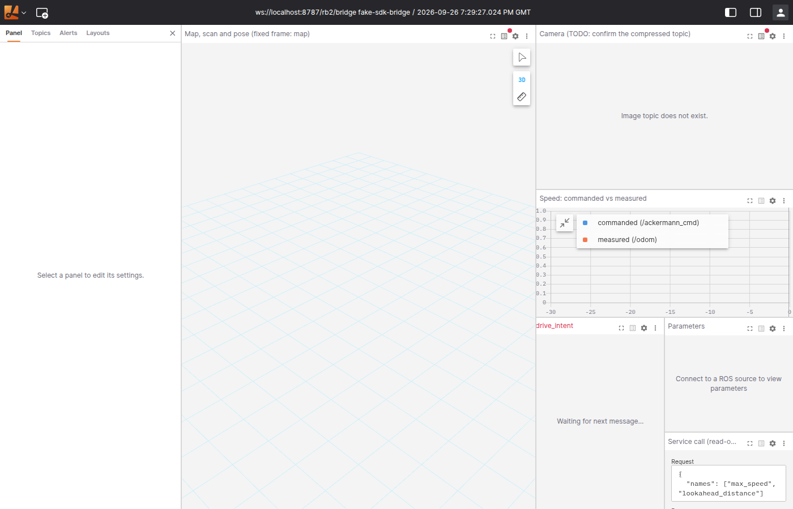
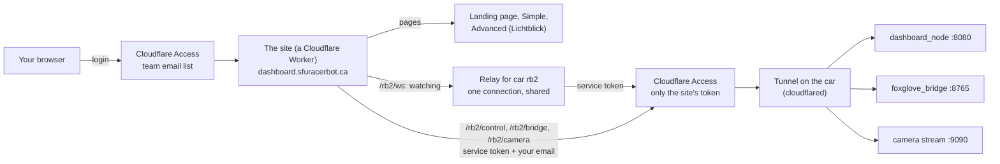

# SFU Racerbot web dashboards

> **Who this is for:** anyone who wants to watch or tune one of the team's cars from a browser, set up a new car, or build the same thing for their own car. No robotics or Cloudflare experience assumed.
> **Read first:** nothing. Everything a team needs is in this one repo: the site **and** the car-side ROS 2 packages. SFU Racerbot's own car workspace ([Racerbot-Car-2-Workspace](https://github.com/sfu-racerbot/Racerbot-Car-2-Workspace)) uses it as a git submodule.
> **What's in it:** what the site does, how it fits together, how to set it up from scratch (car and Cloudflare), how to use it, and how to work on it with no car.

Open **https://dashboard.sfuracerbot.ca**, log in with your team email, and pick a car. You see what the car sees — its map, its LiDAR, where it thinks it is, what it plans to do next, and its camera — live, from anywhere, in any browser. Nothing to install.

| Simple dashboard | On a phone | Advanced dashboard (Lichtblick) |
|---|---|---|
|  |  |  |

*Screenshots are from the [mock car](tools/mock-car/) used for development, not a real run.*

## Contents

- [Highlights](#highlights)
- [The two dashboards](#the-two-dashboards)
- [How it fits together](#how-it-fits-together)
- [What is in this repo](#what-is-in-this-repo)
- [Setting it up from scratch](#setting-it-up-from-scratch)
- [Using it](#using-it)
- [Working on it without a car](#working-on-it-without-a-car)
- [Common questions](#common-questions)
- [All the docs](#all-the-docs)

## Highlights

- **One address for every car, behind a login.** Cloudflare Access lets in a list of team emails and nobody else. See [docs/security.md](docs/security.md).
- **Any number of viewers for the price of one.** A relay per car holds a single connection to it and copies everything to everyone watching, so a crowd around a laptop costs the car's uplink nothing extra.
- **Tuning is per person, and times out.** Watching uses the shared relay, which refuses writes. Changing something opens *your own* control link, which closes after 5 idle minutes or when you switch tabs — and closing it disarms tuning.
- **Nothing runs while nobody watches.** The relay drops the car connection 60 s after the last viewer leaves.
- **Nothing to install on the car's network.** The car makes one outgoing connection to Cloudflare (a tunnel). No open ports, no port forwarding, no VPN.
- **One repo for a whole team.** Clone it, build its two ROS 2 packages on your car, write one YAML file with your car's settings, add your car to the site's list — [car/README.md](car/README.md) walks through all of it.
- **Deploys itself.** Cloudflare builds and publishes the site from this repo on every merge to `main`.
- **Honest limits:** Cloudflare's free plan allows about **13 hours of watching a day** in total ([docs/costs.md](docs/costs.md)); "car online" is only known while someone watches; Advanced needs Chrome or Edge.

## The two dashboards

| | **Simple** | **Advanced** |
|---|---|---|
| What it is | The team's own dashboard, built for the car | [Lichtblick](https://github.com/lichtblick-suite/lichtblick), the open-source fork of Foxglove Studio |
| Shows | Map, LiDAR, pose, drive intent and decision log, speed and steering, camera, stopwatch, CPU/temperature | Every ROS 2 topic, in 3D, plots, images and raw messages |
| Can change | Driving parameters (after arming), stop a driving process, delete a saved map, reset SLAM | Any node's parameters; call services; publish nothing |
| Runs on | Any current browser, phone included | Chrome or Edge on a laptop |
| Best for | Trackside, and everyone watching | Engineers digging into a problem |

The simple dashboard's own manual — every panel, the colours, measuring, tuning — is [car/docs/web-dashboard.md](car/docs/web-dashboard.md).

## How it fits together



In words:

1. **Access** checks that you are on the team's email list. Nobody else gets past this point.
2. **The site** — a small program Cloudflare runs for us, called a Worker — serves the pages. For each car it also:
   - sends your **watching** connection to that car's **relay**. The relay is one copy of a small program per car (a Durable Object) that holds one connection to the car and shares it with every viewer;
   - passes **your own** connections straight to the car: the control link for changes, Lichtblick's bridge connection, and the camera.
3. Every request to the car carries the site's **service token**, a key only the site holds. The car's hostnames refuse anything without it.
4. **The tunnel** on the car receives each request and hands it to the right program on the car.

## What is in this repo

| Folder | What it is | Read |
|---|---|---|
| [`apps/`](apps/) | The three web pages: [`landing/`](apps/landing/), [`simple/`](apps/simple/) (plain HTML/JS/CSS, no build step), and [`advanced/`](apps/advanced/) (the Lichtblick version we build, and the team's default layout) | [apps/simple/SOURCE.md](apps/simple/SOURCE.md), [apps/advanced/README.md](apps/advanced/README.md) |
| [`worker/`](worker/) | The site itself and the per-car relay, in TypeScript, with tests | [docs/decisions.md](docs/decisions.md) |
| [`car/`](car/) | **Everything to run on a car**: the ROS 2 packages `web_dashboard` (the dashboard's server, `remote_check`, and foxglove_bridge's settings) and `usb_cam_stream` (the camera) under [`car/ros/`](car/ros/), the bridge's boot service, the tunnel installer, a check script, and their docs | [car/README.md](car/README.md) |
| [`tools/mock-car/`](tools/mock-car/) | A pretend car, for working on the site with no car | [tools/mock-car/README.md](tools/mock-car/README.md) |
| [`docs/`](docs/) | Setup, decisions, costs, security | [All the docs](#all-the-docs) |
| [`wrangler.jsonc`](wrangler.jsonc) | Cloudflare settings, including **the list of cars** (`CARS`) | |

## Setting it up from scratch

Three parts, done once. **Do them in this order:** the Access rules go up before anything is reachable, so nothing is ever briefly open to the internet.

| Step | Where | Guide | Time |
|---|---|---|---|
| 1. Lock things down: the site's service token, Access on the car's hostnames and on the site | Cloudflare dashboard | [docs/cloudflare-setup.md](docs/cloudflare-setup.md), steps 1–3 | 15 min |
| 2. Set up the car: build the two ROS packages, write the car's YAML, the tunnel, the three routes, the bridge at boot | The car, and the Cloudflare dashboard | [car/README.md](car/README.md) | 45 min |
| 3. Connect this repo to Cloudflare, and give the site the service token | Cloudflare dashboard | [docs/cloudflare-setup.md](docs/cloudflare-setup.md), steps 5–7 | 15 min |

After that, merging to `main` deploys the site, and the car starts the tunnel and foxglove_bridge when it boots. **The dashboard's server and the camera are started by hand** on the car when you want them — nothing else runs at boot.

**Building this for your own car?** The same three steps work with your own domain and your own ROS 2 Jazzy car: everything the car needs is in [`car/`](car/), and [car/README.md](car/README.md) is the complete guide. Then replace `sfuracerbot.ca` in `wrangler.jsonc` (the route, `PUBLIC_ORIGIN` and the `CARS` hostnames) with your domain.

**Adding a car** is one entry in `CARS` in `wrangler.jsonc`, plus that car's tunnel and Access setup: [how](docs/cloudflare-setup.md#adding-a-car).

## Using it

1. Open https://dashboard.sfuracerbot.ca and log in. The landing page lists each car, with a light: green `car online · N watching`, red `car offline`, or grey `idle · nobody watching` (the site only connects to a car while someone watches, so it cannot know yet).
2. Pick **Simple** or **Advanced** for a car.
3. In Simple, the row under `CONNECTED` tells you about the far side of the link: whether the relay has the car, how many are watching, and `CTL OPEN` while you hold a control link.

**Changing things from Simple.** The first time you tune, stop a process, delete a map, reset SLAM or use the stopwatch, the page opens your own control link. Tuning still needs **arm changes** ticked first, exactly as before. The link closes, and tuning disarms, after 5 minutes without a change or as soon as you switch away from the tab.

**If a red banner says "this car runs protocol N, this site expects M"**, the car's software and the site's have drifted apart. The fix is updating whichever is older (the car's workspace, or a merge here); the page keeps working meanwhile.

## Working on it without a car

You need Node 22. Everything runs on your laptop: the site and its relay in `wrangler dev` (Cloudflare's local runner), the car in the mock.

**Terminal 1**, from the repo root — install, once:

```bash
npm ci
cp .dev.vars.example .dev.vars
```

**Working when:** `npm ci` ends without errors.

**Terminal 1** — the pretend car. Leave it running.

```bash
npm run mock
```

**Working when:** it prints `dashboard_node on ws://localhost:8080/ws…`, then a `[rates]` line every 5 s.

**Terminal 2** — the site.

```bash
npm run dev
```

**Working when:** it prints `Ready on http://localhost:8787`. Open that address and choose **Simple**: the pretend car drives round an oval, drawing the map as it goes, and the link row reads `CAR ONLINE · 1 WATCHING`.

Advanced needs Lichtblick built once first (`apps/advanced/build.sh`, a few minutes). The mock has no foxglove_bridge, so Lichtblick will say it cannot connect.

**Tests.** `npm test` runs the site's: the simple dashboard's 10 test files (one checks the page and the car agree on the protocol version), the Worker's unit tests, the mock car's tests and a TypeScript check. **Working when:** every part passes. GitHub runs the same on every push, plus the car-side Python tests that need no ROS (`car/ros/run_ros_free_tests.sh`), a full Lichtblick build and a check against Cloudflare's file-size limits. Which runner runs which test: [car/README.md](car/README.md#running-the-tests). Rules for writing tests: [TEST_QUALITY_STANDARDS.md](TEST_QUALITY_STANDARDS.md).

## Common questions

**Do I need to put secrets in GitHub?** No. Cloudflare builds and deploys the site from this repo itself, so GitHub holds no secrets. The only secrets are the site's service token (`ACCESS_CLIENT_ID`, `ACCESS_CLIENT_SECRET`), and they live in the Worker's settings in the Cloudflare dashboard ([step 6](docs/cloudflare-setup.md)). The car's tunnel token lives only on the car.

**Can I still open the dashboard directly on the car's WiFi?** No: the car serves no pages any more, only the WebSocket the site uses. The camera still answers at `http://<car-ip>:9090/` with no login; to force everyone through the site, see [car/README.md](car/README.md#safety).

**What does it cost?** Nothing on Cloudflare's free plan, up to about 13 hours of watching a day. Workers Paid ($5 a month) covers about 130 hours a month, then under a cent an hour. See [docs/costs.md](docs/costs.md).

**Can Advanced drive the car?** No. The bridge lets a browser publish to no topic at all, so nothing on the site can send a drive command. See [car/README.md](car/README.md#safety).

## All the docs

| Doc | Read it when |
|---|---|
| [car/README.md](car/README.md) | Setting up a car: building the ROS packages, your car's YAML, the tunnel, the bridge at boot, checking every hop, running the tests |
| [car/docs/web-dashboard.md](car/docs/web-dashboard.md) | Using the Simple dashboard, and how its car side works: every panel, tuning and the `live_tunable_spec` contract, the wire contract |
| [car/docs/foxglove-bridge.md](car/docs/foxglove-bridge.md) | What the Advanced dashboard can and cannot do to a car, and why nothing can be published |
| [car/docs/usb-camera-livestream.md](car/docs/usb-camera-livestream.md) | The camera stream |
| [TEST_QUALITY_STANDARDS.md](TEST_QUALITY_STANDARDS.md) | Writing or changing any test in this repo |
| [docs/cloudflare-setup.md](docs/cloudflare-setup.md) | Setting up Cloudflare, connecting the repo, adding a car, giving or removing access |
| [docs/security.md](docs/security.md) | You want to know who can reach what, and why the car can trust the site |
| [docs/costs.md](docs/costs.md) | You want to know what it costs and how many hours the free plan allows |
| [docs/decisions.md](docs/decisions.md) | You want to know why something is built the way it is, and what was checked |
| [docs/follow-ups.md](docs/follow-ups.md) | You are looking for the next thing to work on |
| [apps/advanced/README.md](apps/advanced/README.md) | Upgrading Lichtblick or changing its default layout |
| [apps/simple/SOURCE.md](apps/simple/SOURCE.md) | Comparing the simple dashboard with its car-repo ancestor, and where each of the car repo's tests went |
| [tools/mock-car/README.md](tools/mock-car/README.md) | Working without a car |

## License

This repo's own code: MIT ([LICENSE](LICENSE)). Lichtblick is MPL-2.0 and is built from its unmodified source at the pinned tag.
