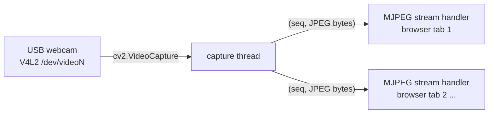

# USB webcam livestream

> **Who this is for:** anyone who wants to watch a car's camera in a browser — in the site's camera inset, or directly on the car's network.
> **Read first:** nothing. To set a car up for the site, [car/README.md](../README.md).
> **You'll be able to:** serve live MJPEG video over plain HTTP, see it on the site, and view it from any machine on the car's network.

`usb_cam_stream` captures a USB webcam and serves it as a live MJPEG video
stream over plain HTTP — open a browser on any device on the network and
watch, with no RViz, no ROS install, no plugins, and no login needed on
the viewing device.

**Terminal 1, on the car, with your workspace sourced:**

```
ros2 launch usb_cam_stream usb_cam_stream_launch.py car_config:=/path/to/your_car.yaml
```

**Working when:** you pick the car on the site and the camera inset fills
in (the site reaches it through the car's `<car>-cam-origin` tunnel route).
On the car's own network you can also open `http://<car-ip>:9090/` directly
(find `<car-ip>` with `hostname -I` on the car). **Port `9090`, not
`8080`** — `web_dashboard` listens on `8080`.

It is started by hand; it does not run at boot.

## Highlights

- **Two streams from one camera, each encoded once.** A small preview (480 px wide by default) for the dashboard's inset and a full-quality one for recording. A stream nobody is watching is not encoded at all. It used to send one 1280×720 stream to both — roughly 34× more picture than the inset could show, at 12–18 Mbit/s.
- **No second compression.** With a camera that already produces MJPEG, the camera's own frames are served untouched (`passthrough`), which is both sharper and nearly free. Probed at startup, with an automatic fallback.
- **Works with cameras that have their own ROS driver.** `image_topic` mode streams any `sensor_msgs/Image` topic instead of opening the device — how SFU Racerbot streams its RealSense.
- **Publishes nothing.** It cannot affect how the car drives, so it can run alongside anything.

**Honest limits:** no audio, no recording, one camera per instance, and a few hundred milliseconds of latency — fine for watching, not for steering. On the car's own network it has no login (see the [security note](#security-note)).

This node **never publishes anything** — by default it talks directly to
the camera over V4L2 with no ROS subscriptions at all, and in
[`image_topic` mode](#image_topic-mode-streaming-a-ros-image-topic-instead)
it only *subscribes* — so either way it never touches `/drive` or any
topic another node reads, carries zero risk to how the car drives, and can
be left running at all times alongside anything else on the car.

## Picking a camera

Any **UVC-compliant** USB webcam works out of the box on Linux with no
driver install — that's the one hard requirement. Beyond that:

- Prefer a camera with an **onboard H.264/MJPEG hardware encoder**
  (Logitech C920/C920x, C922/C922x) — it sends already-compressed video
  over USB instead of raw YUYV, which matters because the Jetson is
  already running the rest of the driving stack. `camera_stream_node`
  asks for MJPEG from the camera itself (`CAP_PROP_FOURCC` set to
  `MJPG`) for exactly this reason, then re-encodes each frame to JPEG at
  its own configured quality for the actual browser-facing stream.
- 720p/1080p @ 30fps is plenty for a spectator/monitoring feed — there's
  no need for 60fps or 4K here, and higher resolutions cost more Jetson
  CPU on the JPEG re-encode step and more WiFi bandwidth per frame.
- A wide-FOV board camera (e.g. ELP-style USB modules, ~100–170°) gives a
  more usable "driver's view" than a standard ~78° webcam if the goal is
  seeing the track ahead, at the cost of no onboard hardware encoder on
  most of those modules.

## How it works



Three concurrency models share one process:

1. **rclpy's executor**, spun on a background thread purely so
   `ros2 param`/lifecycle introspection works on this node — it has no
   subscriptions or publishers of its own.
2. **A dedicated capture thread** that owns `cv2.VideoCapture` exclusively
   and continuously grabs + JPEG-encodes frames. This has to be its own
   thread because OpenCV's `.read()` blocks on I/O, and it must never run
   on Tornado's IOLoop thread (that would stall every connected browser
   for the duration of each camera read).
3. **Tornado's IOLoop**, owning the main thread, serving HTTP — including
   the long-lived multipart MJPEG response each connected browser tab
   keeps open (see [web-dashboard.md](web-dashboard.md) for why this
   workspace already standardized on Tornado for this kind of thing).

The capture thread and every stream handler only ever communicate through
one `(sequence number, JPEG bytes)` pair — a plain attribute write on the
capture thread, a plain attribute read on the IOLoop thread. Both are
atomic under the GIL, and a handler occasionally serving one frame late
is a non-issue for a live video feed, so no lock is used (same reasoning
as `_last_pose` etc. in `web_dashboard_node`).

### The wire format: MJPEG over HTTP, not WebRTC/RTSP

Each connected browser tab opens a single, never-ending HTTP response with
`Content-Type: multipart/x-mixed-replace`. The server keeps writing
`--boundary\r\nContent-Type: image/jpeg\r\n\r\n<jpeg bytes>\r\n` chunks
down that same connection for as long as the tab stays open, and the
browser natively redraws an `` tag with each new chunk — no
JavaScript at all is required on the browser side (see `web/index.html`).

This is deliberately **not** WebRTC or RTSP: those get meaningfully lower
latency but need a signaling server / real-time transport stack for a
genuinely marginal win here, since this is a monitoring/spectator feed,
not a teleoperation control loop. MJPEG's few-hundred-ms latency is a
reasonable trade for "zero moving parts, works in literally any browser,
embeddable with one `` tag."

## Running it

**Terminal 1, on the car, from your workspace:**

```bash
source /opt/ros/jazzy/setup.bash && source ~/racerbot-ws/install/setup.bash
ros2 launch usb_cam_stream usb_cam_stream_launch.py car_config:=/path/to/your_car.yaml
```

**Working when:** the log reports the stream on port 9090, and the site's
camera inset (or `http://<car-ip>:9090/`) shows the picture. With no camera
plugged in the node keeps running and says it is waiting for the device.

This node doesn't touch `/drive`, so none of the joystick-override or
wheels-off-ground precautions for driving code apply to it — it's safe to
start and stop at any time, on top of anything else.

To point it at a different camera, resolution, or port, put those keys under
`usb_cam_stream_node:` in your car YAML; the package's
`config/usb_cam_stream.yaml` holds the generic defaults (a UVC webcam on
`/dev/video0`). See the [parameter reference](#parameter-reference) below.

The launch terminal reports whether the node is waiting for a device/topic or
first frame, the V4L2 mode actually negotiated, live frame count/age/JPEG size,
stale input, conversion/encoding errors, and camera loss/recovery. A missing or
unplugged camera is retried every few seconds rather than crashing the node —
check `v4l2-ctl --list-devices` to confirm the device path.

## `image_topic` mode: streaming a ROS image topic instead

Setting the `image_topic` parameter to a `sensor_msgs/Image` topic makes
the node subscribe to that topic instead of opening a V4L2 device — same
MJPEG endpoint, same browser side, different frame source. This exists for
cameras whose V4L2 device is already held open exclusively by their own
ROS driver: the RealSense D435i's `/dev/videoN` belongs to
`realsense2_camera_node` (see [realsense-camera.md](https://github.com/sfu-racerbot/Racerbot-Car-2-Workspace/blob/main/docs/realsense-camera.md)),
so a second `cv2.VideoCapture` on it fails — but its frames are already on
a topic.

Turn it on in your car YAML:

```yaml
usb_cam_stream_node:
  ros__parameters:
    image_topic: /camera/camera/color/image_raw   # a RealSense's colour topic
    passthrough: false   # frames arrive decoded; there is no camera JPEG to pass through
```

**SFU Racerbot car 2** runs its RealSense this way:
`ros2 launch racerbot_launch realsense_camera_launch.py` starts the RealSense
driver and this stream with car 2's YAML (its
[realsense-camera.md](https://github.com/sfu-racerbot/Racerbot-Car-2-Workspace/blob/main/docs/realsense-camera.md)).

Only one stream can have port 9090 at a time — don't run a second instance
without giving it another `port`.

In this mode `device`/`width`/`height`/`capture_fps` are unused — the
publishing node owns the capture settings; `stream_fps`/`jpeg_quality`/
`host`/`port` still apply as normal.

## Two streams, not one

The camera serves two endpoints, because it has two viewers with opposite
needs:

| URL | What it is | Who uses it |
|---|---|---|
| `http://<car-ip>:9090/stream` | **preview** — small and cheap (`preview_width`, default 480) | the dashboard's camera inset |
| `http://<car-ip>:9090/stream?tier=full` | **full** — the camera's own resolution and high quality | the recording view (`camera.html`), and you, watching directly |

This used to be a single 1280×720 stream at quality 80 serving both. The
dashboard's inset is at most **220 CSS pixels wide**, so the car was
encoding and transmitting roughly 34× more picture than that panel could
ever display — 12–18 Mbit/s, over the same WiFi link the dashboard's own
telemetry needed. That is most of why both used to feel laggy.

Each tier is encoded once and shared by everyone watching it, and **a tier
nobody is watching is never encoded at all** — a dashboard whose camera
panel no one is looking at costs the Jetson nothing.

### Why the picture used to look soft

The capture path asks the camera for MJPEG, which every UVC webcam
produces in hardware. OpenCV then silently *decodes* that to BGR inside
`.read()`, and this node used to *re-encode* it to JPEG at quality 80 — a
second lossy generation on top of the camera's own. With `passthrough`
enabled (the default) the camera's JPEG is served exactly as it came, so
the full tier is sharper *and* costs almost no CPU. Support for that
depends on the OpenCV/V4L2 build, so it is probed once when the camera
opens; the startup log says which mode it settled on:

```
CAMERA [opened] device='/dev/video0', negotiated 1280x720@30.0fps,
passing the camera JPEG through untouched; waiting for first frame
```

If it says `decoding and re-encoding frames` instead, passthrough was not
available and the old behaviour applies. Raising `full_quality` is then
the lever for sharpness.

## Parameter reference

Generic defaults in `car/ros/usb_cam_stream/config/usb_cam_stream.yaml`; override any of them under `usb_cam_stream_node:` in your car YAML:

| Parameter | Default | Meaning |
|---|---|---|
| `device` | `/dev/video0` | V4L2 device path (or a bare index like `0`) — verify with `v4l2-ctl --list-devices`, especially if more than one video device is ever plugged in |
| `image_topic` | `''` (off) | Non-empty switches the frame source to a `sensor_msgs/Image` topic and ignores `device`/`width`/`height`/`capture_fps` — see [`image_topic` mode](#image_topic-mode-streaming-a-ros-image-topic-instead) |
| `width` / `height` | `1280` / `720` | Requested capture resolution — actual resolution falls back to the camera's nearest supported mode if this exact one isn't available |
| `capture_fps` | `30` | Requested camera capture rate |
| `host` | `0.0.0.0` | Listen on every network interface — see [security note](#security-note) |
| `port` | `9090` | Web server port — **not** `8080`, which `web_dashboard` uses. The tunnel's `<car>-cam-origin` route points here |
| `stream_fps` | `30.0` | Upper bound on how often one viewer is sent a frame. Frames are pushed as soon as they exist rather than polled for, so this is a cap rather than a rate |
| `preview_width` | `480` | Width of the small tier that the dashboard's camera inset uses |
| `preview_quality` | `65` | JPEG quality for the preview tier |
| `full_width` | `0` | Width of the full tier. `0` = whatever the camera is producing |
| `full_quality` | `90` | JPEG quality for the full tier — high, precisely because the small tier carries the routine traffic |
| `passthrough` | `true` | Serve the camera's own MJPEG untouched instead of decoding and re-encoding it. Probed at startup, falls back automatically, and logs which mode is in use |
| `jpeg_quality` | *(deprecated)* | Old single quality knob. If set, it is applied to both tiers and logs a warning |
| `frame_timeout_sec` | `2.0` s | Warn when the selected source has not produced a newly encoded frame for this long |
| `status_log_period_sec` | `5.0` s | Repeat the unchanged stream state in the launch terminal (`0.0` = transitions only) |

## Security note

This stream has **no authentication** and serves plain, unencrypted HTTP.
That's a reasonable trade-off for a video-only feed that never accepts
input and can never be used to *command* the car — but it does mean
anyone who can reach `<car-ip>:9090` on the network can watch. Don't
port-forward this to the open internet. For remote access use the site: it
reaches the camera through the tunnel, behind Cloudflare Access. To make the
site the only way in, set `host: 127.0.0.1` under `usb_cam_stream_node:` in
your car YAML — the tunnel only needs localhost.

## Limitations

- **No audio.** Video only — MJPEG-over-HTTP has no audio channel; adding
  audio would need a genuinely different transport (e.g. WebRTC).
- **No recording.** This streams live only; nothing is written to disk.
- **Single camera.** One `usb_cam_stream_node` instance drives one device;
  running a second camera means launching a second instance of this node
  with a different `device` and `port`.
- **Not a low-latency control feed.** A few hundred ms of MJPEG latency is
  fine for monitoring/spectating, not for anything steering-loop-adjacent.

## File map

```
car/ros/usb_cam_stream/
├── usb_cam_stream/
│   └── camera_stream_node.py   # frame source (V4L2 capture thread, or image-topic subscription) + Tornado MJPEG server
├── web/
│   └── index.html              # entire browser side: one  tag
├── config/usb_cam_stream.yaml      # generic defaults (a UVC webcam); a car's YAML goes on top
└── launch/usb_cam_stream_launch.py # car_config:=<your YAML>
```
