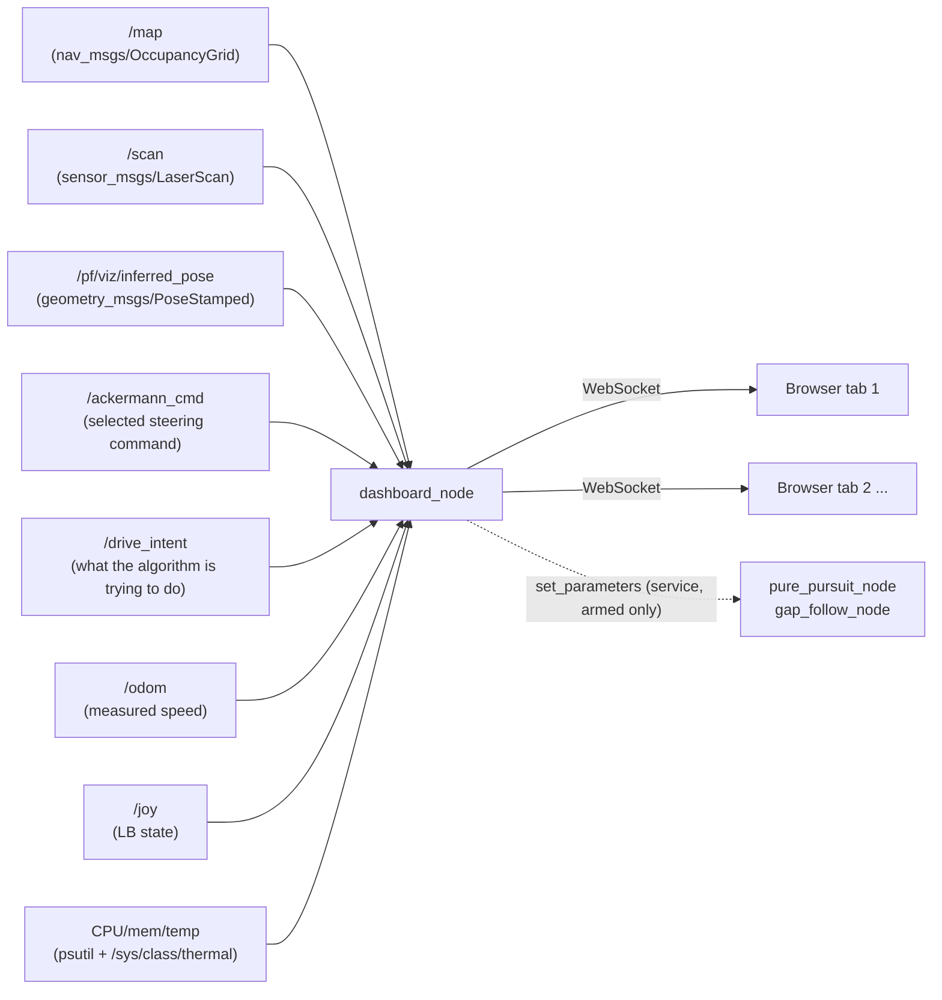

# Live web dashboard: see what the car sees

> **Who this is for:** anyone who wants to see what the car sees, or tune a driving node's parameters while it runs — and anyone running the car-side server, `web_dashboard`, on their own car.
> **Read first:** [car/README.md](../README.md) to set a car up. For SFU Racerbot's car 2, its workspace's [operations.md](https://github.com/sfu-racerbot/Racerbot-Car-2-Workspace/blob/main/docs/operations.md) brings the car up. Safe to run alongside anything — it publishes to no topic.
> **You'll be able to:** watch map, LiDAR and pose live in a browser, and adjust driving parameters without a rebuild.

Open the site (for SFU Racerbot, https://dashboard.sfuracerbot.ca) on a laptop or phone, pick the car, and watch what it is seeing — live, as it drives.

No RViz. No ROS install on the viewing device. Just a URL and your team login.

> **Two halves, one repo.** The page you look at is the site's `apps/simple`. The car runs `web_dashboard`'s `dashboard_node`, which serves no pages at all — only the WebSocket the site connects to. This doc is about both; the car half is in [`car/ros/web_dashboard`](../ros/web_dashboard/README.md).
>
> **Examples use SFU Racerbot car 2** (car id `rb2`, a Hokuyo LiDAR, a RealSense camera, `pure_pursuit` and `gap_follow` as its driving nodes). Your car's names go in your own car YAML — see [car/README.md](../README.md#4-write-your-cars-yaml).

---

## Highlights

- **Streams map updates as changes, not frames.** A full [occupancy grid](https://github.com/sfu-racerbot/Racerbot-Car-2-Workspace/blob/main/docs/glossary.md#occupancy-grid) — the map, stored as a big array of "free / wall / unknown" cells — is 819 kB/s on the wire; after the first send, updates run about **0.04 kB/s**. Total dashboard traffic dropped from **7.1 Mbit/s to 0.45 Mbit/s** — measured, not estimated.
- **Live parameter tuning with no rebuild.** Change a driving node's speeds, geometry or safety margins from a phone and the running node applies them on its next control tick. The old loop — stop, `Ctrl+C`, edit YAML, rebuild, relaunch, re-seed localization — becomes a slider.
- **Read-only by construction.** The [node](https://github.com/sfu-racerbot/Racerbot-Car-2-Workspace/blob/main/docs/glossary.md#node) publishes to **no ROS [topic](https://github.com/sfu-racerbot/Racerbot-Car-2-Workspace/blob/main/docs/glossary.md#topic) at all**. It cannot steer, accelerate or brake, so it's safe to leave running during a race. It has four write paths: tuning, stopping a process, resetting SLAM, and deleting a saved map. Not one of them is a publisher.
- **Clears the stale processes `Ctrl+C` left behind.** A `Ctrl+C` that looked like it worked often leaves a driving node alive and still publishing to `/drive`, so the next run fights it. The [processes panel](#stopping-a-driving-process) lists what is really running and ends it — escalating when a node ignores `SIGINT`, and refusing anything in the actuation path.
- **Measure anything on the map, by tapping it.** Tap two points and read the distance between them; keep tapping and it measures the whole chain, labelling each leg. Track width, the gap to a wall, how far the car stopped short — numbers you previously got by counting grid squares by eye. [See below](#measuring-a-distance-on-the-map).
- **Clears a bad map three different ways, each with its own guard.** Forget the map in this browser, reset the live [SLAM](https://github.com/sfu-racerbot/Racerbot-Car-2-Workspace/blob/main/docs/glossary.md#slam) session, or delete a saved run from the disk for good. A run is deleted whole — map, pose graph and racing line together — and needs its name typed to confirm. [See below](#clearing-the-map).
- **Shows the algorithm's *intent*, not just its output.** A curved arrow ahead of the car draws where the controller plans to go, how fast, and which constraint is currently holding it back — so you can catch a wrong plan while it's still only a plan.
- **Works at every stage.** Nothing else running? You still get live [LiDAR](https://github.com/sfu-racerbot/Racerbot-Car-2-Workspace/blob/main/docs/glossary.md#lidar). [SLAM](https://github.com/sfu-racerbot/Racerbot-Car-2-Workspace/blob/main/docs/glossary.md#slam) up? The map builds in front of you. Once [localization](https://github.com/sfu-racerbot/Racerbot-Car-2-Workspace/blob/main/docs/glossary.md#localization) has a fix, everything locks to world coordinates.
- **A real phone layout, not a shrunken desktop one.** The map fills the screen, a strip along the top always shows link/state/speed, and the sidebar becomes a sheet you drag up from the bottom in three steps. One finger pans the map, two pinch to zoom — [see below](#on-a-phone).
- **Runs on a phone.** One plain JS file, no build step, no framework. A 2048×2048 keyframe is 4.2 million cells, drawn through a palette lookup so a phone can keep up.
- **Costs the car almost nothing.** Packing a map message went from 178 ms to 2.2 ms. With no browser connected, none of the work happens at all.
- **Watch from anywhere, behind a login.** The car makes one outgoing tunnel to Cloudflare; the site reaches it through that, behind Cloudflare Access. No open ports, and one shared connection to the car however many people watch ([car/README.md](../README.md)).

**Honest limits:** port 8080 on the car itself has no login — anyone on the car's own network who can reach it can open a WebSocket and, if tuning is armed, change how the car drives (the site's own login is Cloudflare Access; see the [security note](#security-note)). One car per `dashboard_node`. Live SLAM without a pose republisher shows the map but keeps the car centred rather than locked to it. All three are covered below.

### Why it exists

Debugging a robot without this means reading terminal spam and guessing where the car thought it was. Whether localization had converged, whether the LiDAR saw the obstacle, why the car braked at that corner — all of it was invisible until after the run, if ever.

The dashboard makes the car's own view of the world something you can watch in real time, from any device, while it drives. It's the difference between debugging from evidence and debugging from memory.

---

## What it shows

`web_dashboard` streams, all live:

- the SLAM/localization **map** as it builds — SLAM being the process that draws the map while driving through it
- **LiDAR** returns, coloured by how close they are
- the car's **pose** (position and heading)
- measured **speed** from `/odom` and the selected **steering** from `/ackermann_cmd`
- **LB state** and an LB-gated stopwatch
- coarse **system health** — CPU, memory, temperature, WiFi, uptime
- the **camera feed** in a corner inset, if [`usb_cam_stream`](../ros/usb_cam_stream/README.md) is running
- **drive intent** — what the driving algorithm is trying to do, and why

A [live tuning panel](#live-parameter-tuning) can also adjust a running driving node's speeds and safety margins from the same page.

This is the reference example of "support/tooling code" in [adding-your-own-code.md](https://github.com/sfu-racerbot/Racerbot-Car-2-Workspace/blob/main/docs/adding-your-own-code.md) — read that first if you're building something similar.

> **This doc covers the workflow, what you'll see, and how the pieces fit together.** For a line-by-line code walkthrough — the wire protocol, every parameter, the thread-bridging pattern — see [car/ros/web_dashboard/README.md](../ros/web_dashboard/README.md).

---

## Start it

Started by hand, on the car — it does not run at boot. `car_config` is your car's YAML ([car/README.md, step 4](../README.md#4-write-your-cars-yaml)).

**Terminal 1, on the car, from your workspace:**

```bash
source /opt/ros/jazzy/setup.bash && source ~/racerbot-ws/install/setup.bash
ros2 launch web_dashboard web_dashboard_launch.py car_config:=/path/to/your_car.yaml
```

**Working when:** the log reports the server listening on port 8080 and lists your site under `allowed origins`. Then open the site and pick the car; the link row reads `CAR ONLINE`.

**SFU Racerbot car 2:** `ros2 launch racerbot_launch dashboard_launch.py` does exactly this with car 2's YAML — see its workspace's [docs/web-dashboard.md](https://github.com/sfu-racerbot/Racerbot-Car-2-Workspace/blob/main/docs/web-dashboard.md).

**If the site says `CAR OFFLINE`:** run `ros2 run web_dashboard remote_check --site https://<your site> --car <car id>` on the car, and open `https://<your site>/<car id>/check`. Together they say which hop fails ([car/README.md](../README.md#troubleshooting)).

**No other node needs to be running first.** Worst case, with nothing else up, the page just shows "no [scan](https://github.com/sfu-racerbot/Racerbot-Car-2-Workspace/blob/main/docs/glossary.md#scan) yet" — a scan being one sweep of LiDAR distance readings.

### Why it's safe to start at any time

This node **publishes to no ROS topic at all** — not `/drive`, not `/ackermann_cmd`, not anything. It cannot steer, accelerate, or brake the car.

So the workspace's [mandatory LB-deadman policy](https://github.com/sfu-racerbot/Racerbot-Car-2-Workspace/blob/main/docs/architecture.md#workspace-policy-the-lb-deadman-button-is-mandatory-for-every-node-that-can-move-the-car) does not apply to it. That policy is scoped to nodes that can *move the car* (see [writing-your-own-node.md](https://github.com/sfu-racerbot/Racerbot-Car-2-Workspace/blob/main/docs/writing-your-own-node.md#the-interface-contract)), and there's no driving output here for a deadman check to gate. Reading LB only gates the stopwatch.

Leave it running at all times, alongside anything else on the car: its hardware bringup, SLAM, localization, its driving nodes, all of it.

> **It is not purely a *viewer* any more, though.** Four features reach the car rather than just watching it, and all four are on by default.
>
> [Live parameter tuning](#live-parameter-tuning) calls the standard `/<node>/set_parameters` service on the driving nodes your car YAML names in `tuning_nodes`.
>
> [Stopping a driving process](#stopping-a-driving-process) can end a driving node's operating-system process — never anything in the actuation path, and it can only stop things, never start them.
>
> [Resetting live SLAM](#reset-the-live-slam-session) throws away the map `slam_toolbox` is building and starts it again. Refused while a driving node is running.
>
> [Deleting a saved map](#delete-a-saved-run-permanently) removes files from the disk permanently. It is the only thing on this page with no undo.
>
> All four are real paths to the car. Read those sections and the [security note](#security-note) before using this at a shared venue. `enable_tuning: false`, `enable_process_control: false`, `enable_slam_reset: false` and `enable_map_delete: false` give you the strictly read-only dashboard back.

---

## What you'll actually see

The dashboard degrades gracefully depending on what's running, so it's useful at every stage of [operations.md](https://github.com/sfu-racerbot/Racerbot-Car-2-Workspace/blob/main/docs/operations.md) — not just once everything is set up.

| Running | What the dashboard shows |
|---|---|
| Just [`/scan`](https://github.com/sfu-racerbot/Racerbot-Car-2-Workspace/blob/main/docs/glossary.md#scan) (LIDAR driver only) | **Robot-centric mode**: the car fixed at the center of the screen, always facing "up", with the raw LIDAR points drawn around it exactly as the beams came in. No map, no localization needed — this is literally "what the car is seeing," live. |
| `/scan` + `slam_toolbox` mapping | The map builds and updates live in the background as you drive; the scan stays robot-centric (see [Limitations](#limitations) for why the overlay doesn't lock onto the map during live SLAM specifically). |
| `/scan` + a saved map + `particle_filter` localized (seeded with RViz's "2D Pose Estimate") | **Map-relative mode**: the map is the background, the car is drawn at its real localized position and heading, and the LIDAR points are drawn in true world coordinates — so you can directly see where the car is relative to the walls, other objects, and the rest of the track. |

### Reading the colours

The dashboard is styled as a **HUD** — a heads-up display, the kind of instrument panel you'd see in a cockpit. Near-black background, cyan hairlines and corner brackets, small uppercase labels, monospaced numbers.

That look carries one rule that's worth knowing before you read anything off the page:

**Colour means state, never decoration.**

- **Cyan** is *the system talking* — the car marker, the rectangle on the minimap showing what you're looking at, the scale bar. Cyan is never an opinion about how the car is doing.
- **Green, amber and red** are reserved for what the car has **decided**: go, caution, stop.

So anything red on this page means something. That's also why the car icon is cyan rather than red: a permanently red car competed with "stop" meaning stop, and after a while the eye stops believing red.

**The one exception is the LiDAR points**, and it's a scale rather than a state: red at 10 cm through orange and yellow to green at 2 m. It carries its own legend, in the `feeds` section, for exactly that reason.

### Getting just `/scan` without the rest of the hardware

If you only want LiDAR — no `joy_node`, [VESC](https://github.com/sfu-racerbot/Racerbot-Car-2-Workspace/blob/main/docs/glossary.md#vesc) (the motor controller), or `ackermann_mux`, which otherwise only come bundled via `bringup_launch.py` — run the LiDAR driver directly with the same config:

**Terminal 2, from `~/racerbot-ws`:**

```bash
source /opt/ros/jazzy/setup.bash && source ~/racerbot-ws/install/setup.bash
ros2 run urg_node urg_node_driver --ros-args --params-file src/f1tenth_system/f1tenth_stack/config/sensors.yaml
```

**Working when:** the dashboard's scan feed dot turns green and points appear around the car.

The Hokuyo is Ethernet-connected (see [hardware-reference.md](https://github.com/sfu-racerbot/Racerbot-Car-2-Workspace/blob/main/docs/hardware-reference.md#lidar--hokuyo-ust-10lx)). On a fresh boot, if the `hokuyo` NetworkManager profile hasn't auto-connected yet, bring it up first with `nmcli connection up hokuyo`, then confirm with `ping 192.168.0.10`.

---

## How it works



One ROS2 node (`dashboard_node.py`) does two jobs in one process:

1. **Subscribes** to map, scan, pose, selected command, odometry, and joy topics, exactly like any other node. It separately samples system stats (CPU, memory, temperature, uptime) on a timer rather than from a topic.
2. **Runs a small web server** that serves the dashboard's HTML/JS/CSS as static files, and pushes every update to any connected browser tab over a WebSocket.

The server is [Tornado](https://www.tornadoweb.org/) — a mature, single-dependency Python library that already ships on this machine.

These subscriptions only feed displays and the dashboard-local stopwatch. Enabling or resetting the stopwatch changes no car state.

<details>
<summary><b>Two concurrency models sharing one process</b> — the rclpy-to-Tornado thread bridge. A genuinely reusable pattern if you ever need to connect rclpy to an asyncio library.</summary>

rclpy's executor (which calls this node's subscription callbacks) and Tornado's IOLoop (which runs the web server) don't share a thread by default.

This node spins rclpy on a background thread and lets Tornado's IOLoop own the main thread. Every subscription callback hands its update to the IOLoop via `add_callback()` — Tornado's documented thread-safe hand-off — instead of ever touching a WebSocket connection directly from the ROS thread.

See the comments at the top of `dashboard_node.py` for the full reasoning.

</details>

<details>
<summary><b>The wire protocol</b> — how a 2000×2000 occupancy grid gets to a phone without melting the WiFi. Read if you're changing the protocol or debugging a corrupt message.</summary>

Sending a 2000×2000-cell occupancy grid as a JSON array of numbers would be enormous and slow to parse.

Instead, every update travels as two messages back to back:

1. **One JSON text message** — the metadata. "Here's what's coming and how to read it."
2. **One binary message** — the raw payload.

The binary payload is chosen to match a JavaScript `TypedArray` byte-for-byte, so the browser does zero manual parsing.

| Update | JSON header | Binary payload |
|---|---|---|
| Map (keyframe) | `seq`, width, height, resolution, origin, `encoding` | the whole grid, one signed byte per cell, exactly matching `OccupancyGrid.data` (-1 unknown, 0 free, 100 occupied) — deflated |
| Map (patch) | `seq`, `x`, `y`, `w`, `h`, `encoding` | only the rectangle of cells that changed since the previous map message |
| Scan | `encoding`, angle range/increment, LIDAR mounting offset | `Uint16Array` of millimetres (default) or `Float32Array` of metres — half the bytes for a difference below one screen pixel |
| Batch | `items`: a tick's worth of the compact updates below, in one frame |  *(none)* |
| Pose | `{x, y, yaw}` | *(none — small enough to just be JSON)* |
| Drive | selected-command `{speed, steering_angle}` | *(none)* |
| Speed | measured `{speed}` from odometry | *(none)* |
| Stopwatch | elapsed/enabled/running plus LB/freshness flags | *(none)* |
| Stats | `{cpu_percent, mem_percent, cpu_temp_c, uptime_s, wifi_dbm}` | *(none — `cpu_temp_c`/`wifi_dbm` are `null` if no readable thermal zone / wireless interface was found)* |
| Intent | what the driving node is *trying* to do: predicted path, speeds, the constraint currently binding, and the reason — see [drive-intent.md](https://github.com/sfu-racerbot/Racerbot-Car-2-Workspace/blob/main/docs/drive-intent.md) | *(none)* |
| Tuning | the whole panel: per node, whether it's up, its advertised catalogue, and every current value | *(none)* |
| Tuning result / saved / armed | outcome of one change, of a save, and this connection's arm state | *(none)* |
| Saved maps | every run directory the car can see: what each holds, its size, and whether it may be deleted | *(none)* |
| Map delete / SLAM reset result | outcome of one delete or one reset, with the reason when refused | *(none)* |
| Map cleared | answer to "clear the view": whether the car still has a map to send | *(none)* |

All of this conversion lives in `web_dashboard/protocol.py`, deliberately kept free of any ROS, Tornado, or network imports.

That's what makes it directly unit-testable (`test/test_protocol.py`) without a running robot, browser, or web server.

</details>

<details>
<summary><b>What this costs the car</b> — the full before/after measurements on WiFi and CPU, and where the CPU floor actually comes from. Worth reading before you believe the "safe to leave running" claim.</summary>

The dashboard is documented above as safe to leave running at all times, including during a race. That is only an honest claim if it is genuinely cheap, so here is what it actually costs, measured on this car's Jetson.

**On the WiFi link**, per connected tab, while driving with SLAM mapping:

| | Before | After |
|---|---|---|
| `/map` | 819 kB/s (the whole 2048×2048 grid, re-sent every 5s) | ~0.04 kB/s (a patch), or ~24 kB compressed on a keyframe |
| scan | 44 kB/s (float32) | 22 kB/s (uint16 millimetres) |
| intent | 31 kB/s | 24 kB/s (the commanded path is dropped while it matches the desired one) |
| pose + command + speed + stopwatch | 14 kB/s | folded into one 20Hz frame |
| WebSocket frames | ~155/s | ~40/s |
| **total** | **~914 kB/s (7.1 Mbit/s)** | **~57 kB/s (0.45 Mbit/s)** |

Measured live against the simulator over a 60s mapping run: **61 kB/s, 0.48 Mbit/s, zero dropped frames**.

Re-run it yourself with `python3 car/tools/bench_protocol.py`, or against a live car with SFU Racerbot's `tools/racerbot_sim/capture_dashboard.py --report` (in its car workspace).

**Why this mattered so much while *driving* specifically** is circular. Driving is when `slam_toolbox` is mapping, and `slam_toolbox` republishes its entire grid every `map_update_interval` whether or not anything in it changed.

The region that actually changed between two of those messages compresses to about 200 bytes.

**On the Jetson's CPU**, the honest picture is more mixed.

Packing the map went from 178 ms to 2.2 ms per message, and the fan-out from ~3.3% of a core to ~0.8%. None of it happens at all when no browser is connected.

But `dashboard_node`'s *total* CPU is dominated by rclpy's own executor and message deserialization, which this work does not touch. With no browser attached it sits around 35% of a core — right alongside `auto_map_race` (34%), `pure_pursuit` (32%) and `gap_follow` (25%) in the same run.

Every Python node in this workspace pays that floor. Attaching a browser is now lost in the noise of it.

If you need the node itself cheaper than that, the lever is `enable_tuning: false`, which removes two service clients and the 0.5Hz graph query — not any of the above.

</details>

<details>
<summary><b>The browser side</b> — rendering, the map palette, coordinate transforms, and the car icon. Read if you're changing the UI or wondering why the map is a different colour scheme from RViz.</summary>

`apps/simple/web/dashboard.js` is one plain file — no build step, no framework. It connects to `ws://<host>/ws`, keeps the latest map/scan/pose/command/speed/stopwatch/stats in a small state object, and redraws an HTML5 `<canvas>`.

**Moving the map.** Drag to pan — with a mouse or with one finger, and it works both before and after [localization](https://github.com/sfu-racerbot/Racerbot-Car-2-Workspace/blob/main/docs/glossary.md#localization) (the car working out where it is on the map).

Zoom with the scroll wheel, or with a two-finger pinch on a touchscreen. Either way it zooms toward the pointer or the middle of the pinch, not the middle of the screen.

Double-click or double-tap the map to re-fit it, which is the same thing the **reset view** button does. On a phone that button is inside the sheet, so a double-tap saves dragging the sheet up to undo a stray pinch.

> Touch gestures are new. Before this the dashboard listened only for mouse and wheel events.
>
> On a phone that meant the map could not be panned or zoomed **at all**. Nothing said so either: no gesture did anything, and no error appeared anywhere.

**The browser owns the map.** The occupancy grid is rendered into an off-screen canvas, and thereafter the car sends only patches, which are blitted into that same canvas.

So the expensive full redraw happens on connect and on the occasional keyframe, rather than every few seconds.

Each cell is coloured through a 256-entry palette indexed by its raw byte: one lookup and one 32-bit store, rather than a branch and four byte writes. That matters when a 2048×2048 keyframe is 4.2 million cells and the thing doing the work is a phone.

Patches carry a sequence number and are applied only when they are the exact successor of the last frame. On any gap the browser waits for a keyframe, rather than painting a map that is subtly wrong.

Compressed payloads are inflated with `DecompressionStream`. If a browser is old enough not to have it, the console says so, and `map_compression: false` is the fix.

**Repaints are coalesced** through `requestAnimationFrame`: many state updates arriving together (a batch frame carries several) produce one repaint, not one each. A hidden tab draws nothing at all while still tracking everything the car sends — worth knowing if you leave the dashboard open on a second monitor or a phone in your pocket.

**The map palette is deliberately not RViz's.** The ROS/RViz convention of white free space on mid-gray unknown looked like a lit-up slab pasted over the page, and washed out the scan drawn on top of it.

The polarity is inverted instead:

- **unknown** fades almost completely into the page background
- **free space** is a dark slate "track surface"
- **occupied cells** are the bright end — a desaturated blue-gray

That keeps walls the most legible thing in the map, without competing with the saturated red→green LIDAR points or the cyan car icon. Cells between free and occupied interpolate between the two.

Since unknown area fades out, a one-pixel cyan hairline — the same one every panel border uses — marks the grid's extent. All three colors are constants at the top of `applyMap()`'s section in `dashboard.js` if the theme ever changes.

**Two coordinate transforms, two pan offsets.** Robot-centric mode (no pose yet) and map-relative mode (once localized) use `bodyToCanvas` vs `worldToCanvas`.

So panning and zooming track their own offset in each: `view.bodyPanX/bodyPanY` for the former, `view.centerX/centerY` for the latter.

They deliberately don't share one, since a drag that happened before localization has no meaningful world-frame equivalent to carry over.

**The car icon.** A top-down car silhouette rather than a bare arrow, and **drawn to scale**.

The outline is the car's real footprint: 0.36 m between the axles, 0.30 m across the tires. It is anchored at `base_link` — the rear axle, which is the point every pose refers to.

So the icon is the size of the car against the map. At the zoom where the whole map fits on screen that would be a couple of pixels, so below a floor of about 24 px long it stops shrinking and is knowingly drawn larger than life.

Rounded cyan body with a faint glow, four dark wheels sitting exactly on the outline, and a dark "windshield" stripe near the nose. The stripe is the one cue that makes heading unambiguous at the smallest sizes. A plain rectangle looks the same front-to-back.

**A small ringed dot marks the LIDAR**, 0.26 m ahead of the rear axle. It is worth its own mark because the beams radiate from there, not from the dot the pose puts on the map — about three-quarters of the way up the car.

**The front wheels turn** with the last commanded steering angle.

They use real Ackermann geometry, computed from the two measured numbers. ("Ackermann" is the steering arrangement a car uses: the inside wheel of a turn traces a tighter circle than the outside one, so the rack turns it further.)

When a turned tire reaches outside the parked footprint, a short dashed line appears on that side showing how much room the front end is actually asking for. Nothing is drawn there when the wheels are straight.

If `/drive` goes stale the wheels snap back to straight, rather than leaving the car cocked over from a command nobody is sending.

**LIDAR points are painted on top of the car icon**, not under it.

Because the icon is a real footprint at real scale, it otherwise covers the beams closest to the car — exactly the ones reading a wall it is about to touch.

`apps/simple/test/browser/car_model_test.js` asserts that order for every combination of what has arrived. It is the kind of thing a later refactor reorders without noticing.

A translucent red wedge marks the LIDAR's actual blind spot: the arc it physically never scans. The Hokuyo's ~270° field of view leaves a real ~90° gap behind its mount.

That wedge is computed from the scan's own `angle_min` / `angle_increment` / count, **not** guessed from which beams read "no return" this frame. Open space with nothing in range would look identical to a blind spot that way, and shouldn't be flagged as one.

Valid returns use a proximity scale: **red at 10 cm or nearer**, through orange and yellow, to **green at 2 m or further**. The legend under `feeds` states those two distances, so you never have to remember which end is which.

That band is deliberately tight around the distances that matter to a car this size. It used to run 0.3 m to 5 m, which spent most of its range on distances where nothing was at stake and left everything inside a metre looking much the same shade.

A scale bar in the bottom-left corner shows the current zoom level in meters or cm.

**The faint grid behind everything** is not texture. It does two jobs:

- Its spacing is one of the same round metre steps the scale bar reports, so a distance on the map can be counted off in squares.
- It's anchored to the world origin rather than to the screen, so it slides *under* the car as the car moves.

That second job is the real reason it's there. Drag across an unmapped region without it and nothing appears to move, because there's nothing in view to move.

</details>

<details>
<summary><b>Layout: what every panel does</b> — sidebar, minimap, camera inset, and the resizing behaviour. Read when you want to know what a control does or why the sidebar behaves as it does.</summary>

**Nothing on this page resizes itself while you're reading it.** Numbers use a monospaced font with tabular figures, so a changing digit never changes a column's width.

Every region that fills in later — the decision log, the reason text, the connection banner — has its space reserved up front and scrolls inside it.

That's a fix rather than a preference. Measured with WebDriver over 20 seconds of streaming telemetry, the decision log used to gain 16.5 px per decision.

Every one of those entries shoved the stopwatch, the `system` section and the pinned footer further down the sidebar — every time the car changed its mind.

If you edit `apps/simple/web/style.css`, keep both that rule and the colour rule above. There are comments at the top of that file explaining each, and `apps/simple/test/web_assets_test.js` pins the structural parts so a redesign can't quietly undo them.

**Left sidebar**, in order:

- connection status
- `feeds`
- `intent`
- `vehicle` — measured speed, selected steering, LB state
- an LB-gated stopwatch, with enable and reset — though this one **starts detached**, in the right-hand rail (see below)
- `system` health
- `live tuning` — which driving nodes are tunable, plus the button that opens the panel

Feed dots are gray = never received, green = fresh, red = stale.

**Sections collapse.** Click a header to fold it away. A collapsed section still shows its headline value in its own header, so hiding `vehicle` does not cost you the speed. Which ones you keep open is remembered in your browser, per device.

The sidebar is bounded to the window and scrolls, and each row shows a short value with the full detail in its tooltip. Both are fixes rather than preferences.

> Previously the sidebar grew to whatever height it wanted while the page itself could not scroll. On a laptop or a phone, the bottom of it — the decision log, the tuning button, "reset view" — was rendered below the bottom of the screen with no way to reach it.
>
> The decision log and the reason text scroll on their own, which they also could not do before. The whole sidebar ignored pointer events so that you could drag the map "through" it — which meant the scroll wheel went past the log to the canvas and zoomed the map instead.
>
> Panning still works everywhere outside the sidebar.

**Any section can be pulled out of the sidebar into its own floating panel**, and the arrangement is remembered in your browser.

Hover a section header and a small **↗** appears on the right. Click it and that section becomes its own panel, leaving the sidebar (which gets shorter). The **⤓** button on the floating panel puts it back.

Drag a floating panel by its title bar to move it. The sidebar and the minimap move too — drag them anywhere that isn't a button or the scrolling area.

Bring a panel within about 12 pixels of another panel's edge, or of the screen edge, and it snaps flush to it. A cyan line shows the edge it locked onto. Snapped panels stay independent, so moving one does not drag the other along.

Grab any edge or corner to resize. The camera inset is the exception and keeps its own top-left grip, because it stays locked to the video's shape — see below.

**reset layout**, next to **reset view**, puts everything back.

Two behaviours here are deliberate rather than accidental:

> **The LB stopwatch starts detached**, in the right-hand rail between the minimap and the camera. It is the one readout people watch from several metres away while somebody else drives, so it gets its own space instead of being one collapsed row in a sidebar.
>
> **On a narrow window everything comes home.** Below about 900px there is no room to float panels usefully, so they all return to the sidebar and the ↗ buttons disappear. Your wide-screen arrangement is kept rather than discarded — widen the window and the panels go back where you put them.
>
> Below 640px you get [the phone layout](#on-a-phone) instead, which is a different arrangement rather than a narrower version of this one.

**Top-right inset** — a minimap. It always shows the *whole* map at a fixed auto-fit scale, independent of the main canvas's own pan and zoom.

A rectangle in the UI's accent cyan shows what the main view currently frames, plus a small marker for the car.

So zooming into one corner of the track on the main canvas doesn't lose the big picture. Shows a placeholder until a map has arrived.

**Bottom-right inset** — the live camera feed, if [`usb_cam_stream`](../ros/usb_cam_stream/README.md) is running.

This is a completely separate node on its own port (`9090`). The page points an `` at the site's `/<car>/camera/stream`, which the site passes down the car's `<car>-cam-origin` tunnel route to that port. An MJPEG stream is a plain, never-ending HTTP response: no WebSocket, no JSON frame.

If that node isn't running, the inset shows a "camera offline" placeholder and retries the connection every 3 seconds — no need to reload the dashboard page once the camera node starts.

Either source fills this panel: a UVC webcam (the package default), or a ROS image topic via `image_topic` in your car YAML — SFU Racerbot car 2 streams its RealSense D435i's colour feed that way ([realsense-camera.md](https://github.com/sfu-racerbot/Racerbot-Car-2-Workspace/blob/main/docs/realsense-camera.md)). Only one stream can hold port 9090, so run one at a time.

Click the inset to open a new full-window recording tab with current time, speed, steering, LB, stopwatch, CPU, and WiFi overlays; use the browser's tab or screen recording on that view.

**Resizing the camera inset:** hover it and a grip appears in its top-left corner, where the "camera" label normally sits. Drag it to make the feed as large or small as you want; double-click to go back to the default size.

The panel is pinned to the bottom-right corner, so that's the only corner that can move.

Dragging *scales* the panel along the stream's own aspect ratio rather than reshaping it freely. The inset is therefore always exactly the shape of the frame: the whole image visible at every size, never cropped and never letterboxed.

It won't grow over the sidebar or up into the minimap, and the size is remembered in the browser's `localStorage` (per browser, not per session — the car doesn't know about it). Dragging the grip never opens the recording tab, even though the rest of the panel is a link.

</details>

### On a phone

<details>
<summary><b>The bottom sheet, the status strip, and the touch gestures</b> — read if you use the dashboard trackside from a phone, or if you are changing the small-screen layout.</summary>

Below 640px wide the dashboard uses a **different arrangement**, not a squeezed version of the desktop one.

The reason is simple arithmetic. The sidebar is 320px wide, and a common phone screen is 390px. Docked at the side, it covers the map it exists to annotate — and the map is why anyone opens this page at the trackside.

So on a phone:

**The map fills the whole screen.** Nothing sits permanently on top of it except the strip described next.

**A thin strip across the top is always visible**, with four things and no interaction needed to see them:

- a dot for the link to the car — green when connected, red when not
- what the car is currently doing (the [intent](#drive-intent-the-arrow-and-the-decision-panel) state: `DRIVE`, `CAUTION`, `STOP`, and so on), in the same colour it has everywhere else on the page
- the measured speed
- how many of the four feeds (map, scan, pose, command) are live, as `3/4`

If the link drops, the strip says `LINK LOST` and replaces the numbers with `--`, rather than leaving the last ones showing.

A stale number with nothing marking it as stale is indistinguishable from a current one.

**The sidebar becomes a sheet you pull up from the bottom.** It has three positions:

| Position | What you see |
|---|---|
| closed | the grab handle, the connection line, and the banner explaining anything odd about the picture |
| half | the sheet over the bottom half of the screen — the sections, with the map still visible above |
| full | the sheet over almost the whole screen, for working in the tuning and processes panels |

Drag the handle at the top of the sheet to move it, and it settles into whichever position you left it nearest.

A quick flick always moves it one position in the direction you threw it, even if your finger barely travelled — otherwise a short sharp flick snaps back to where it started and feels broken.

Tapping the handle cycles closed → half → full → closed. It is a real button, so a keyboard `Enter` or `Space` does the same thing.

**The minimap is hidden.** It is an overview inset for a map that is already filling the screen, and the space is worth more.

**The camera inset stays**, smaller, under the top strip. Tapping it still opens the recording view. Its drag-to-resize grip is switched off here — on a touchscreen that gesture only ever fired by accident.

**Text and hit areas grow.** Every font size on the page comes from one of eight variables, and the phone breakpoint re-states all eight.

Separately, a touchscreen of any size raises every button and row to a 40px minimum — that one applies to a tablet too.

</details>

<details>
<summary><b>Why the phone sheet moves with <code>transform</code> and never <code>height</code></b> — read before changing the sheet's CSS.</summary>

The sheet is always its full height. Closing it slides it down past the bottom of the screen with a CSS `transform`, leaving only the peek showing.

The obvious alternative is to animate its `height`. That re-lays-out every row inside the sheet on every frame of the drag.

It would do that on top of a canvas already painting telemetry at 20Hz, on the least powerful screen this page ever runs on.

That is the second of the two rules written at the top of `apps/simple/web/style.css`, and `apps/simple/test/web_assets_test.js` fails if the sheet's transition ever mentions a property that can reflow the page.

Two numbers have to agree between `apps/simple/web/style.css` and `apps/simple/web/panels.js`: the 640px breakpoint, and where the half position sits (46% of the sheet's height).

The stylesheet decides whether the sheet styling applies at all. The script decides whether the gestures that drive it are live.

If they disagree there is a window width with a sheet nobody can open. Both are pinned by tests, which read the number out of each file and compare them.

</details>

<details>
<summary><b>The recording view (<code>camera.html</code>)</b> — the full-window camera page and its fullscreen behaviour. Read if you're capturing footage.</summary>

Clicking the camera inset opens this in a new tab: the camera feed as the whole page, with a compact telemetry overlay (clock, speed, steering, LB, stopwatch, CPU, WiFi) in the top-left. It's meant to be captured with the browser's or OS's own screen recorder.

By default the frame is **letterboxed** — the entire image is visible, with dark bars wherever the window's shape and the camera's disagree. That's what you want while framing a shot.

**Fullscreen fills the screen with no bars at all:** click `fullscreen` in the top-right, press `F`, or double-click the video. The frame is scaled up until it covers the screen and whatever overflows the edges is cropped.

It's never stretched, since a distorted frame would misrepresent how far away things are. `F` again or `Esc` leaves fullscreen and returns to the whole-frame view.

The fullscreen button and the mouse cursor both fade out after ~2.5 s of no input, so neither ends up baked into a recording. Any mouse movement or keypress brings them back.

</details>

---

## "The map looks glitchy"

Three different things produce that complaint and they have different fixes, so **measure before changing anything.**

**Terminal 1, from `~/racerbot-ws`:**

```bash
# Connect for a whole run, validate every frame, write a picture per phase
tools/racerbot_sim/capture_dashboard.py --seconds 280 --interval 40 \
    --output /tmp/run.png --report /tmp/run.json
```

**Working when:** it exits zero. A non-zero exit means at least one binary frame failed its length check. The report separates the causes below.

### 1. The view moving, not the map

The dashboard frames the map automatically until you pan or zoom.

It used to re-derive centre and zoom from *every* `/map` message — and `slam_toolbox` resizes and re-origins its grid constantly as the map grows, shrinking as often as growing.

> Measured over 130 s of mapping: 27 map messages, **18 view disturbances, the picture sliding up to 3.6 m and rescaling by up to 36%**, while the map itself was perfectly good.

It now frames the map once and re-fits only when the map no longer fits on screen. The same run gives **2**, both of them the map genuinely growing.

**If you want it to stop moving entirely, pan or zoom once.** That latches `userAdjusted` and auto-fit never runs again.

### 2. The map really is bad

Thick, doubled or fuzzy walls are `slam_toolbox` smearing scans over a drifting odometry estimate. The dashboard is telling the truth.

Reproduced deliberately with an 18% odometry scale error: the walls come out visibly thickened and the inner island's edge becomes a dotted band.

**That is a calibration problem** ([odom-calibration.md](https://github.com/sfu-racerbot/Racerbot-Car-2-Workspace/blob/main/docs/odom-calibration.md)), not a display one. The supervisor's `SLAM corrections absorbed=` counter in the mapping log is the matching number — a handful per lap is normal, dozens is not.

### 3. Two stacks running at once

Worth ruling out first, because it looks worse than either of the above.

A leftover launch publishing a second `/map` and a second pose makes the dashboard alternate between two unrelated worlds, frame to frame.

```bash
ros2 node list | grep slam
```

**Working when:** exactly one result.

Two results means a previous launch is still running. The [processes panel](#stopping-a-driving-process) lists leftovers like that and can end them without leaving the browser.

<details>
<summary><b>Frame corruption, and why it is now impossible to miss</b> — the guard against a header/payload desync. Read if you're changing the protocol.</summary>

Every map and scan travels as a JSON header immediately followed by one binary frame, and the browser holds a single "what does the next binary mean" slot.

A header that never gets its binary leaves that slot pointing at the wrong thing, and the *next* payload is decoded as the previous type.

A 1081-beam scan read as occupancy cells is 4324 bytes against an 80000-cell header. Every read past the end is undefined, every colour computes to NaN, and **the map paints as garbage rather than failing**.

That's the dangerous part: a silent wrong answer rather than an error.

So both headers now declare `bytes`. The browser checks it and drops the frame rather than painting it, and the count appears in the mode banner.

The server also drops any client whose header/payload pair it could not complete, so that client reconnects and resynchronises.

Across the validation runs above — roughly 7,500 binary frames — **zero** frames failed that check. So this is a guard against a failure that has not been observed, rather than a fix for one that has. It costs one integer per header.

</details>

---

## Running it

Everything here runs on the car, and you watch it through the site. `dashboard_node` and the camera are started by hand; only `foxglove_bridge` starts at boot ([car/README.md](../README.md)).

### Dashboard by itself — map, scan, pose, no camera

**Terminal 1, on the car, from your workspace:**

```bash
source /opt/ros/jazzy/setup.bash && source ~/racerbot-ws/install/setup.bash
ros2 launch web_dashboard web_dashboard_launch.py car_config:=/path/to/your_car.yaml
```

**Working when:** the site shows the car as `CAR ONLINE` and the map, scan and pose fill in as those topics appear.

That's the entire procedure for the dashboard alone.

This node reads command, odom and joy only for display and its local stopwatch, and publishes to no topic. So none of the joystick-override or wheels-off-ground precautions for driving code apply to *starting* it — it's safe to start and stop at any time, on top of anything else.

(Changing a driving node's parameters from its tuning panel is a different matter — see [Live parameter tuning](#live-parameter-tuning).)

To point it at different topics — testing against a bag file, say — or a different port, put those keys in your car YAML. The package's own `config/web_dashboard.yaml` holds the generic defaults; see the [parameter reference](#parameter-reference).

**SFU Racerbot car 2:** `ros2 launch racerbot_launch dashboard_launch.py` — the same launch with car 2's YAML.

### With the camera panel filled in too

Two terminals, each sourced the same way as above. Order doesn't matter: both are support/tooling nodes and neither touches `/drive`, so there's no bringup sequencing and no LB-deadman precaution here.

**Terminal 2, on the car** — a UVC webcam on `/dev/video0` (the package default):

```bash
ros2 launch usb_cam_stream usb_cam_stream_launch.py car_config:=/path/to/your_car.yaml
```

**Working when:** the camera inset on the site fills in within a few seconds. With no camera plugged in the node keeps running and the inset says "camera offline" — that's fine.

**A camera that already has a ROS driver** (a RealSense, say) holds its device open, so set `image_topic` in your car YAML to its colour topic instead of using `device`. See [usb-camera-livestream.md](usb-camera-livestream.md).

**SFU Racerbot car 2:** `ros2 launch racerbot_launch realsense_camera_launch.py` starts the RealSense driver and this stream, with car 2's YAML.

If the inset stays "camera offline" while the stream is running, check the car's `<car>-cam-origin` tunnel route points at port 9090 — `remote_check` lists it ([car/README.md](../README.md#troubleshooting)). The panel retries every 3 seconds on its own.

### Watching the simulator instead of the car

The dashboard subscribes to topics and nothing else, so it works unchanged against any simulator that publishes the car's own topic names — `/scan`, `/odom`, `/ackermann_cmd`, `/joy`, `/drive_intent`.

**SFU Racerbot car 2** has one: [`racerbot_sim`](https://github.com/sfu-racerbot/Racerbot-Car-2-Workspace/blob/main/docs/ros-simulator.md). `ros2 launch racerbot_sim sim_auto_map_race_launch.py track:=indoor_wide dashboard:=true` runs the whole race stack plus the dashboard; the step-by-step version is its [sim-validation.md](https://github.com/sfu-racerbot/Racerbot-Car-2-Workspace/blob/main/docs/sim-validation.md).

> **That simulator refuses to run beside the real car's drivers**, because it forges a held LB deadman and an imaginary LiDAR. The interlock is described in [ros-simulator.md](https://github.com/sfu-racerbot/Racerbot-Car-2-Workspace/blob/main/docs/ros-simulator.md#it-refuses-to-run-next-to-the-car). Don't defeat it.

Two differences from a real run, both expected: the camera inset reads `camera offline` (no simulated camera), and the map stays empty unless something publishes `/map`.

### What the car's port 8080 serves: the WebSocket, and nothing else

`dashboard_node` serves **no web pages**. Every page request gets a 404; only `/ws` answers. The pages are the site's `apps/simple`, and the site reaches the car through the Cloudflare tunnel, which dials `127.0.0.1:8080` on the car.

So `http://<car-ip>:8080/` in a browser shows a 404 — that is correct, not a fault. (It used to serve the old copy of the page from `web/`; that copy was removed when the pages moved to this repo.)

The node still listens on every interface, IPv4 **and** IPv6, with `host: 0.0.0.0` (the default). Set `host: 127.0.0.1` in your car YAML to make the tunnel the only way in — see the [security note](#security-note).

**Terminal 1, on the car**, to confirm what it's listening on:

```bash
ss -tlnp | grep 8080
```

**Working when:** you get two lines — `0.0.0.0:8080` and `[::]:8080` (or `*:8080`) — with the default `host`, or one `127.0.0.1:8080` line if you restricted it. The node says so at startup too: look for `Serving on port 8080` in the launch output.

<details>
<summary><b>Why <code>0.0.0.0</code> wasn't already enough</b> — the bind-address trap, and why it got its own module. Skip unless you're changing how the server binds.</summary>

The trap is that `0.0.0.0` does not mean "every interface". It means every *IPv4* interface, and there is no IPv4 wildcard that also covers IPv6. Binding with **no address at all** is what gets both families.

It bit SFU Racerbot when the page was still served from the car: browsing it over Tailscale by name, the browser tried the IPv6 address first, and nothing was listening there.

So `netbind.wants_all_interfaces()` recognises the wildcard spellings (`0.0.0.0`, `::`, `*`, empty) and the node then binds with no address. Naming a real address, like `127.0.0.1`, still restricts the dashboard to exactly that address — that behaviour is unchanged, and is what the [security note](#security-note) below relies on.

That decision lives in its own `rclpy`-free module, `car/ros/web_dashboard/web_dashboard/netbind.py`, specifically so it can be unit-tested directly.

`test/test_netbind.py` binds real sockets and asserts that the old way is IPv4-only while the new way answers on both.

It has to go that far because this class of bug is completely invisible to a test that only checks a return value.

</details>

---

## Remote access through the site

The dashboard's web page is the site: this repo's `apps/simple`, served by a Cloudflare Worker (for SFU Racerbot, at **https://dashboard.sfuracerbot.ca**).

Cloudflare Access sits in front of it, so only a few specific email addresses can sign in. The car only has to answer the site. Setting that up — the tunnel, the three routes, the Access applications and your `CARS` entry — is [car/README.md](../README.md) and [docs/cloudflare-setup.md](../../docs/cloudflare-setup.md).

### What runs where

Drawn for SFU Racerbot's site and its car `rb2`; for yours, read `<car>-dash-origin.<your domain>` and so on.

```
 browser ──► dashboard.sfuracerbot.ca (Cloudflare Worker, checks who you are)
                │
                ├─ Durable Object: ONE "relay" WebSocket per car ──┐  fans telemetry out
                ├─ your own "control" WebSocket, for write actions ─┤  to every viewer
                ├─ Lichtblick ──────────────────────────────────────┤
                └─ camera ──────────────────────────────────────────┤
                                                                    ▼
                      Cloudflare Tunnel (cloudflared, already running on the car)
                                                                    │
   rb2-dash-origin.sfuracerbot.ca   ──► 127.0.0.1:8080  dashboard_node   (this doc)
   rb2-bridge-origin.sfuracerbot.ca ──► 127.0.0.1:8765  foxglove_bridge  (foxglove-bridge.md)
   rb2-cam-origin.sfuracerbot.ca    ──► 127.0.0.1:9090  usb_cam_stream   (usb-camera-livestream.md)
```

A **Durable Object** is a small always-on program Cloudflare runs for the site. There is one per car. It holds a single connection to this dashboard and copies what it receives to everyone watching, so ten viewers cost the car what one does.

Each of the three origin hostnames sits behind a Cloudflare Access *service auth* policy that only the site's Worker can pass. That is what makes the headers below trustworthy: nothing but the Worker can reach these hostnames, and the Worker strips those headers from every browser request before setting its own.

### Which web pages may connect: `allowed_origins`

Every browser tells a WebSocket server which web page opened it, in the `Origin` header. The dashboard now accepts a connection only when:

- the page's origin is listed, exactly, in `allowed_origins` — **unset in the package**, so your car YAML must name your site (SFU Racerbot car 2's says `["https://dashboard.sfuracerbot.ca"]`); or
- the page came from the dashboard's own host and port (**same origin**) — kept for completeness, though the node serves no pages any more; or
- there is no `Origin` header at all, which means a script or tool rather than a browser.

Anything else gets **HTTP 403** before the connection opens, and the node logs `refused a WebSocket from origin ...`.

"Exactly" means scheme, host and port all match: `http://` is not `https://`, `:8443` is not the default port, and there are no wildcards. An entry with a path or a trailing slash (`https://dashboard.sfuracerbot.ca/`) can never match a real `Origin` header, so the node ignores it and warns at startup.

The dashboard used to accept **every** origin, which meant any website open in a browser on the car's WiFi could open a connection to it and reach the write paths. This rule closes that.

### `hello`, and the protocol version

The first message on every connection, before anything else, is:

```json
{"type": "hello", "protocol_version": 1}
```

The site and the car are now deployed separately, so each checks it is talking to a version it understands. **`protocol_version` goes up by one on any incompatible change to the wire format** — see the rule in [car/ros/web_dashboard/README.md](../ros/web_dashboard/README.md#the-wire-protocol-protocolpy). When the site sees a number it doesn't expect, it shows a banner telling you to update the car or the site.

Both halves live in this repo now, and `PROTOCOL_VERSION` in `car/ros/web_dashboard/web_dashboard/protocol.py` is the one source of truth: `apps/simple/test/protocol_version_test.js` (part of `npm test`, so CI) fails if the page's `SUPPORTED_PROTOCOL_VERSION` or the mock car's default disagrees with it. A bump has to land on both sides in the same change.

### Roles: relay, control, and neither

The site says which kind of connection it is opening with an `X-Racerbot-Role` header:

| Role | Opened by | Receives | May write? |
|---|---|---|---|
| `relay` | the Durable Object — one per car, no person behind it | `hello`, then the full telemetry stream exactly as a browser always got it | **No.** Every write is refused with a `write_refused` message saying to use `/control` |
| `control` | one per signed-in person | `hello`, the tuning snapshot, the process list, the saved-run list, the stopwatch, and replies to **their own** actions. No map, scan or batch frames | Yes, exactly as a direct browser: tuning still needs its own per-connection arm |
| *(no header)* | a client on the car's own network — in practice a script or tool, since the car serves no pages | Everything, unchanged | Yes, unchanged |

Any other value (`admin`, `Relay`, an empty string) gets **HTTP 400** and no connection. A site and car that disagree about the contract should fail loudly, not quietly get the wrong permissions.

"Reads" still work on the relay: re-listing processes or saved runs, and `map_control` `clear_view`, which re-sends the current map to that one connection. The Durable Object can use that to resynchronise its copy of the map.

<details>
<summary><b>Which messages a late joiner has to be given</b> — for whoever works on the site's Durable Object. Skip otherwise.</summary>

The car sends some messages only when a connection opens, or only when something changes. A viewer who joins after that has never seen them, so the Durable Object must keep the latest copy of each and hand it to every new viewer:

| Message | When the car sends it | Keep |
|---|---|---|
| `hello` | once, first, per connection | the one it got |
| `map` (+ binary) | new connection; resize; first sight; every `map_keyframe_sec` (30 s) | the latest keyframe **and every `map_patch` after it**, in `seq` order — or send `{"type":"map_control","action":"clear_view"}` on the relay to get a fresh keyframe |
| `map_patch` (+ binary) | on change only; nothing at all while the map is unchanged | see `map` |
| `racing_line` | new connection; when the line changes | latest |
| `tuning` | new connection; when the tuning picture changes | latest |
| `processes` | new connection; when the running set changes | latest |
| `saved_maps` | new connection; when the run list changes | latest |
| `pose`, `drive`, `speed`, `intent`, `stats` | standalone on a new connection; after that **only inside `batch`**, and only when their topic publishes | latest of each (a parked car, or one without localization, may not send them again for a long time) |
| `stopwatch` | new connection; then in every `batch` (`stopwatch_update_rate_hz`, 4 Hz) | latest |
| `scan` (+ binary) | new connection; then about 10 Hz while `/scan` publishes | latest, optionally |
| `tuning_armed` | new connection (always `false`); replies to an arm | never forward the relay's to viewers — arming belongs to one control connection |
| `tuning_result`, `tuning_saved`, `process_result`, `map_delete_result`, `slam_reset_result`, `map_cleared`, `write_refused` | replies to one action | don't cache |

</details>

### Who did it: `X-Racerbot-User`

Control, bridge and camera requests carry `X-Racerbot-User: <email>`. The dashboard writes it into the log with every write action — accepted or refused:

```
dashboard write: process_control stop pid=4242 -- accepted (user alice@sfu.ca, control connection #7, from 127.0.0.1)
```

A direct LAN or Tailscale browser has no such header and is logged as `unknown (direct)`. The relay is logged as `none (relay)`.

Only trust the name for connections that came through the tunnel (they show `from 127.0.0.1`). A LAN client could send the header itself. That gains it no extra permission, but it could put a false name in the log.

### No pages on the car: `serve_static` is gone

The node used to serve a copy of the page from its own `web/` folder (`serve_static: true`). That copy was removed when the pages moved into this repo's `apps/simple`, so the node now answers `/ws` and 404s everything else, always. A YAML that still says `serve_static: true` gets a warning at startup and is otherwise ignored.

### Troubleshooting remote access

**Start with the checker.** It tests every hop from the car's side in one go — the three local services, a handshake exactly as the site's relay makes it, the tunnel's routes, public DNS, how Cloudflare's edge answers, and which site connections actually reached the dashboard — and prints a fix for each failure. It is read-only and safe any time.

**Terminal 1, on the car:**

```bash
source /opt/ros/jazzy/setup.bash && source ~/racerbot-ws/install/setup.bash
ros2 run web_dashboard remote_check --site https://<your site> --car <car id>
```

For SFU Racerbot car 2: `--site https://dashboard.sfuracerbot.ca --car rb2`.

**Working when:** it ends with `Everything this car can check is fine`. Then the fault is on the site's side: open `https://<your site>/<car id>/check`, which probes the same hops from the Worker with the real service token.

Things worth knowing about what it reports, all learned on 2026-09-27:

- **A tunnel route with no DNS record** is a real failure. The route shows in the tunnel's config, but the hostname does not resolve, so nothing can reach it.
- **A bot challenge ("Just a moment…", HTTP 403) is only a warning.** Cloudflare shows it to this checker because it is not a browser. The site's Worker is not challenged — its check got through to the dashboard the same day. The warning exists because a challenge also hides whether Access is protecting the hostname, so confirm that from the Worker's side.
- **The site's check reports the bridge as a 502 even when it is fine.** foxglove_bridge only speaks WebSocket, and hangs up on a plain web request without answering; cloudflared turns that into a 502. The bridge answers `101` to a WebSocket upgrade that asks for its `foxglove.sdk.v1` subprotocol, and `400 Missing expected sec-websocket-protocol header` to one that doesn't. This checker's step 1 is the one to trust for "is the bridge running".

Since 2026-09-27 the dashboard also logs every connection opening and closing, with its role, user and address, so "did anything from the site arrive at all?" has an answer in its log.

| Symptom | Likely cause | Fix |
|---|---|---|
| Everything on the car is fine, yet the site never connects | A missing DNS record or tunnel route, or the page never opened a viewer connection | `ros2 run web_dashboard remote_check --site ... --car ...` — it names which, and the fix |
| The site's `/<car>/check` says the bridge is 502 | Its probe is a plain web request, which foxglove_bridge hangs up on | Not a fault if `remote_check` step 1 shows port 8765 listening |
| The site's socket gets **403** | The site isn't in `allowed_origins` | Check `allowed_origins` in your car YAML — unset, a typo, or a trailing slash; the node's startup line lists what it allows |
| The site's socket gets **400** | An `X-Racerbot-Role` other than `relay`/`control` | The site and car disagree on the contract — check both versions |
| Version banner on the site | `protocol_version` differs between the car and the site | Update whichever is older: rebuild and restart `web_dashboard` on the car, or redeploy the site |
| Remote camera shows offline | `usb_cam_stream` isn't running (it is started by hand), or the tunnel's `<car>-cam-origin` entry points at the wrong port | `ss -tlnp \| grep 9090` on the car; check the tunnel's public hostname entry |
| A panel says **"use /control"** | A write was sent on the relay connection | A site bug: writes belong on the user's control connection |
| `http://<car-ip>:8080/` shows a 404 | Nothing is wrong: the car serves no pages | Open the site instead |

---

## Drive intent: the arrow and the decision panel

Once a driving node is running, the dashboard draws a curved arrow ahead of the car showing where the algorithm **intends** to go, and a sidebar panel explaining **why** it is deciding what it is deciding.

Full specification, safety contract, and the porting guide for teammates' codebases: [drive-intent.md](https://github.com/sfu-racerbot/Racerbot-Car-2-Workspace/blob/main/docs/drive-intent.md).

> **This is not measured speed or heading redrawn** — those are already on screen under *vehicle*. It is the plan the controller is acting on, which is what lets you catch a wrong plan while it is still only a plan.

Reading the arrow:

| What you see | What it means |
|---|---|
| **Length** | Distance the plan covers over `intent_horizon_sec` (1.5s). A stopped car draws no arrow; a fast one draws a long one. |
| **Width** | Planned speed, sampled along the arrow — so it tapers into a corner and flares coming out. |
| **Curve** | `pure_pursuit` re-runs its steering law along the racing line, so the arrow bends through the corner ahead. `gap_follow` chooses a heading rather than a path, so its arrow is a single arc. |
| **Colour** | Green = ordinary driving, amber = something unusual (corner fallback, overtake, reactive override), red = stopped. |
| **Dashed line** | What the command actually on the wire will produce. The gap between it and the solid ribbon *is* the slew-rate/acceleration shaping. |
| **Blue wedge** | The gap `gap_follow` selected out of the scan, drawn from the LIDAR's own origin. |
| **Dot + label** | The point being steered at — `gap target` or `steering target`. |
| **Dashed stub + ring** | A stop. The stub shows where the steering rack is being *held*, which `gap_follow` does deliberately rather than centring it. |

The panel below shows the current state and the reason sentence — the same text the terminal logs.

It also lists every speed ceiling that competed, with the binding one in bold, and a rolling log of the last 20 state transitions with how long each held.

**The binding limit is the thing to look at first.** It answers "what is actually holding the car back right now", which a single commanded-speed number cannot.

Untick *arrow* in the panel header to hide the overlay without touching the car — useful while lining up a waypoint recording.

If nothing is publishing, the panel says so and the map is unchanged. This is another purely additive subscription; the dashboard still publishes to no topic.

**During `auto_map_race_node`'s mapping phase, two nodes are publishing `/drive_intent` at once** — `gap_follow_node` driving, and `pure_pursuit_node` truthfully idle (`waiting_for_profile`) since it has no racing line yet. The dashboard shows only the one `/auto_map_race/controller` names as currently driving, so the panel reads as one coherent decision instead of flickering between two independently-true states. Run either driving node alone, without `auto_map_race_node` in the graph, and every message passes through unfiltered exactly as before — there is no second node to disambiguate from.

---

## Live parameter tuning

Open the **live tuning** panel from the sidebar to change a running driving node's speeds, geometry, and safety margins without editing YAML and relaunching.

Values apply on the node's very next control tick, so you can lower `max_speed`, feel the difference on the next lap, and put it back. The loop that used to be "stop the car, `Ctrl+C`, edit a file, rebuild, relaunch, re-seed localization" becomes a slider.

**This is the only part of the dashboard that reaches the car**, so it's worth understanding exactly what it can and cannot do.

### What it can't do

- **It cannot move the car.** There is still no publisher to `/drive` here. The car moves because an autonomy node decided to, and only while the driver holds LB. Tuning changes *how* a moving car behaves; it can never start one.
- **It cannot relax the deadman.** `enable_deadman` is not tunable, from here or from `ros2 param set`, on any node — the driving nodes refuse it at runtime. The [workspace LB policy](https://github.com/sfu-racerbot/Racerbot-Car-2-Workspace/blob/main/docs/architecture.md#workspace-policy-the-lb-deadman-button-is-mandatory-for-every-node-that-can-move-the-car) is a team decision, not a knob.
- **It cannot switch off `pure_pursuit`'s reactive safety net.** Its *thresholds* are tunable — a margin that's wrong for the track is a real thing to discover mid-session. `enable_lidar_safety` itself is not.
- **It cannot exceed a node's own limits.** Every tunable carries a hard min/max enforced inside the node that owns it, on every update. The dashboard's sliders stop at the same bounds, but only so the UI doesn't offer a value that will bounce. **The authority is in the node** — which is why a hand-rolled `ros2 param set` hits the same wall.
- **It cannot reach a teammate's code.** Only nodes named in `tuning_nodes` are ever probed, and they must additionally advertise a `live_tunable_spec` parameter to appear at all.

### The racing line on the map

Once a controller loads a racing line, the dashboard draws it over the map, coloured by the profile's own target speed: **green where it plans to be fast, amber where it plans to brake.**

That colouring is the useful part. A racing line drawn in one colour tells you the shape; drawn in two it tells you where the speed profile thinks the corners are, which is what you actually want to check before letting the car run it.

**The line's presence is the answer to "is pure pursuit racing yet?"** It cannot appear until a profile has been accepted, so an empty map means no profile — which on the 2026-08-19 run was true for the entire session while it looked like a slow race.

The sidebar readout under **racing line** says which node loaded it, how many waypoints, how long the lap is, and its speed range.

> **"Loaded" is not quite "driving".** The line appears the moment a profile is accepted. Under [`auto_map_race`](https://github.com/sfu-racerbot/Racerbot-Car-2-Workspace/blob/main/docs/racing-autonomy.md#the-fast-path-map-and-race-from-one-launch) command authority moves a couple of seconds later, after a deliberate stop (`transition_stop_sec`). The **DRIVING** badge described below is what says the handover has actually happened.

The line is latched, so a browser opened mid-race still gets it. It survives the controller exiting — reload the page to clear a stale one.

Turn it off with **show racing line on map** if it clutters the view.

### Which node is actually driving

During an [`auto_map_race`](https://github.com/sfu-racerbot/Racerbot-Car-2-Workspace/blob/main/docs/racing-autonomy.md#the-fast-path-map-and-race-from-one-launch) run, **both** `gap_follow_node` and `pure_pursuit_node` are running and tunable at the same time — but only one of them is driving the car at any moment. `gap_follow` drives the mapping laps; `pure_pursuit` takes over for the race.

The panel says which. The one in control is sorted to the top and badged **DRIVING** in green; the other is dimmed and badged **NOT DRIVING**.

**Why it's there:** on the 2026-08-19 run every live-tune change went to `pure_pursuit_node` while `gap_follow_node` drove every metre of the run. The car was under `gap_follow` the whole time, so nothing the operator changed did anything — and `pure_pursuit` was parked waiting for a racing line, so it did nothing there either. The panel gave no clue.

The badge comes from `auto_map_race_node`, which publishes the controller it has selected on a latched topic. It reports which controller is *selected*, not whether the car is currently moving, so it does not flicker every time the car stops or LB is released.

**No badge at all is normal.** Run `gap_follow_launch.py` or `pure_pursuit_launch.py` on its own and there is only one driving node, nothing to confuse it with, and nothing publishing that topic.

### Arming

Every control is inert until you flip **arm changes** at the top of the panel, and it starts disarmed on **every page load**. A reload, a dropped WiFi link, or a phone going to sleep all disarm it.

That's enforced on the server, per connection — not just greyed out in the browser — so a stale tab or a hand-rolled WebSocket client is refused the same way.

### Safety margins are marked

Parameters that move a collision margin or an emergency stop are grouped under a **Safety margins** heading in amber, with an amber accent on each control.

They're deliberately included: those are exactly the numbers you'd want to correct after watching the car stop too early on a tight section. But **they should never be dragged with the same casualness as a lap-time knob.**

### Live-only, until you save

Changes live in the running node's memory. **Restart the node and it's back to the config file.**

That's the useful property: a tune that turns out to be wrong is one `Ctrl+C` away from gone, and there's always a known baseline. Each control shows a **↺** once it differs from the value the node started with, which puts that single parameter back.

When a tune is worth keeping, **save tune to config files** writes it into the [package](https://github.com/sfu-racerbot/Racerbot-Car-2-Workspace/blob/main/docs/glossary.md#package)'s YAML: `src/pure_pursuit/config/pure_pursuit.yaml` and `src/gap_follow/config/gap_follow.yaml`.

Those resolve through the `--symlink-install` chain to the real, git-tracked sources.

Only values that actually differ from the file are written, and every comment, blank line, and key order is preserved, so the result is a small diff you can read:

```bash
git diff src/gap_follow/config/gap_follow.yaml
```

**Working when:** the diff shows only the values you changed, with comments and ordering intact.

> **Review it before committing.** A saved tune is a change to the car's defaults for everyone. Set `tuning_allow_save: false` to allow live tuning but forbid writing to disk, which is a reasonable race-day setting.

### What's tunable

Each node advertises its own catalogue, so the panel is always in sync with the code rather than a hardcoded list that rots.

To read it from a terminal:

```bash
ros2 param get /gap_follow_node live_tunable_spec
```

**Working when:** it prints a JSON catalogue rather than "Parameter not set".

SFU Racerbot car 2's two tunable nodes, as an example:

| Node | Groups |
|---|---|
| `pure_pursuit_node` | Speed (`max_speed`, `min_speed`, accel/braking, `max_lateral_accel`), Line following (lookahead trio, `max_steering_rate`), Avoidance, Overtaking, and Safety margins (`emergency_stop_distance`, `emergency_stop_clearance`, `safety_fov_deg`, `max_cross_track_error`) |
| `gap_follow_node` | Speed, Gap selection (`min_gap_distance`, `disparity_threshold`, `steering_gain`, …), and Safety margins (`max_braking_decel`, `safety_margin`, the forward reserve, TTC) |

The catalogues themselves — names, bounds, and the prose shown in the UI — live in each driving node's own package; for car 2, [`pure_pursuit/live_tuning.py`](https://github.com/sfu-racerbot/Racerbot-Car-2-Workspace/blob/main/src/pure_pursuit/pure_pursuit/live_tuning.py) and [`gap_follow/live_tuning.py`](https://github.com/sfu-racerbot/Racerbot-Car-2-Workspace/blob/main/src/gap_follow/gap_follow/live_tuning.py).

Adding a parameter is a change there, deliberately: it means picking a hard range and writing down what the knob does, in code that gets reviewed.

<details>
<summary><b>Why a node has to opt in</b> — the silent-failure this prevents, and the error messages you'll get. Read before adding a tunable, or if <code>ros2 param set</code> just refused you.</summary>

Both driving nodes read their parameters once at startup and cache them on instance attributes, because re-reading a parameter at 40Hz in the control loop would be pointless overhead.

That means a plain `ros2 param set` on a parameter the node doesn't explicitly handle **succeeds and changes nothing**. The parameter server stores the new value, the control loop keeps using the cached one, and a dashboard reading the value back would cheerfully display `max_speed: 2.0` for a car still driving 4.0.

So the nodes now **refuse** any runtime parameter change they don't know how to apply, instead of accepting it silently:

```
$ ros2 param set /gap_follow_node car_width 0.9
Setting parameter failed: 'car_width' cannot be changed while the node is
running. The control loop caches its parameters at startup, so accepting
this would change the reported value without changing how the car drives.
Restart the node with a new config to change it.
```

That's a deliberate tightening, and it applies to `ros2 param set` as much as to the dashboard.

Cross-parameter invariants are enforced the same way, and a rejected batch changes nothing at all — no half-applied speed limits:

```
$ ros2 param set /gap_follow_node min_speed 3.0
Setting parameter failed: min_speed (3) cannot exceed max_speed (1.5)
```

`pure_pursuit`'s existing runtime `waypoints_file` update — how `auto_map_race_node` hands over a freshly generated racing line — is unaffected.

</details>

### The `live_tunable_spec` contract

This is the whole agreement between a driving node (in *your* car workspace) and the dashboard (in this repo). They live in different repositories now, so it is written down here and in SFU Racerbot's car workspace ([docs/web-dashboard.md](https://github.com/sfu-racerbot/Racerbot-Car-2-Workspace/blob/main/docs/web-dashboard.md)), and each side has a test that holds its half.

**What the node does:**

1. Declares a **read-only string parameter** named `live_tunable_spec`, holding one JSON object:

   ```json
   {"version": 1, "node": "my_controller_node",
    "params": [{"name": "max_speed", "group": "Speed", "label": "max speed",
                "kind": "float", "min": 0.5, "max": 4.0, "step": 0.1,
                "unit": "m/s", "safety": false, "description": "top speed on a straight"}]}
   ```

   `name`, `group`, `kind`, `min` and `max` are required in each entry; `kind` is `float` or `bool`; `min` ≤ `max`. `label`, `step`, `unit`, `safety` (marks a safety margin in the UI) and `description` are optional. The dashboard supports `version` 1 only (`tuning.SUPPORTED_SPEC_VERSIONS`); an entry it cannot use is skipped, and a spec with none left shows as unavailable.
2. **Enforces its own bounds** in an `on_set_parameters` callback, and refuses — rather than silently accepts — any change it cannot apply live (see the fold-out above). The dashboard clamps a request into `[min, max]` before sending it, but the node is the authority: a spec is a description, not a safety mechanism.
3. **Applies an accepted change on its next control tick**, by updating whatever attribute the control loop reads.

**What the dashboard does:**

- Probes only the nodes named in `tuning_nodes`, calling the standard `/<node>/get_parameters` and `/<node>/set_parameters` services — nothing else, no topics.
- Parses the spec with `web_dashboard/tuning.py`'s `parse_spec`, and writes a saved tune into the file named in `tuning_config_files` with `update_yaml_values`, which keeps every comment and moves no value other than the ones requested.

**Who tests what:**

| Side | Test | Holds |
|---|---|---|
| This repo | `car/ros/web_dashboard/test/test_tuning.py` | `parse_spec` accepts a valid spec and refuses each malformed shape; the YAML writer round-trips two real, heavily commented configs (snapshots of SFU Racerbot car 2's, in `test/fixtures/`) |
| SFU Racerbot's car workspace | `src/gap_follow/test/test_gap_follow_live_tuning.py`, `src/pure_pursuit/test/test_pure_pursuit_live_tuning.py` | each node's real spec parses with **this repo's** `tuning.parse_spec`, and each node's **live** config round-trips through `update_yaml_values` — importing `tuning.py` from the `src/web_dashboards` submodule |

Change the spec format and you change both repos: bump `version`, teach `parse_spec` the new one (keeping the old), and only then move the nodes.

### Testing a tune before trusting it

Same order as any other change to driving behavior ([writing-your-own-node.md](https://github.com/sfu-racerbot/Racerbot-Car-2-Workspace/blob/main/docs/writing-your-own-node.md#testing-before-its-on-wheels)): wheels off the ground first, then floor at low speed, then open space.

> **A slider makes a change *fast*, not *safe*.** Raising `max_speed` mid-session deserves the same care as editing it in YAML would.

---

## Measuring a distance on the map

> **What you'll be able to do:** tap two points on the map and read the distance between them, in metres.

Open the **measure** panel in the sidebar and tick **measure on the map** (or just press <kbd>M</kbd>).

Now every tap on the map drops a point:

- **Two taps** give you one distance — a straight line from A to B, labelled with its length.
- **Keep tapping** and it keeps going. Each leg gets its own label, and the panel shows every leg plus the running total.

**Working when:** a cyan line appears between your taps with a number on it, and the total shows in the small readout at the bottom-right of the map.

**Dragging still pans the map, and pinching still zooms.** Only a tap — pointer down and up in about the same place — adds a point. A drag that wanders and comes back to where it started is a drag, not a tap.

| You want to | Do this |
|---|---|
| Add a point | Tap the map |
| Remove the last point | **undo**, or <kbd>Backspace</kbd> |
| Start over | **clear**, or <kbd>Esc</kbd> |
| Put the tool away | Untick the box, press <kbd>M</kbd>, or press <kbd>Esc</kbd> with nothing measured |

### What it's actually good for

Track width, mostly.

`pure_pursuit`'s racing-line optimizer is bounded by how much room it has to work in — `profile_wall_clearance`, 30 cm by default. So "is this section wide enough for the line I'm about to run" is a question worth answering *before* the run rather than after.

After that: how far the car stopped short of a wall, how big a gap really is, whether two parts of the map that look the same distance apart actually are.

### The one thing to watch out for

**Before [localization](https://github.com/sfu-racerbot/Racerbot-Car-2-Workspace/blob/main/docs/glossary.md#localization) has a fix, a measurement is relative to the car, not to the track.**

With no pose, the dashboard draws the car fixed at the centre of the screen, with the [LiDAR](https://github.com/sfu-racerbot/Racerbot-Car-2-Workspace/blob/main/docs/glossary.md#lidar) returns around it — see [What you'll actually see](#what-youll-actually-see).

That picture is real, but it moves with the car.

A measurement taken in it says "these two things were 1.2 m apart *at that moment*". That is still a useful answer about a gap the car is looking at. It is not a place on the map.

The panel says `robot-centric` while that is true, so you don't have to remember which mode you were in.

**When a localization pose does arrive, a robot-centric measurement is cleared, and the panel says why.**

It is not kept and quietly redrawn in map coordinates. Those points were measured against a car that has since moved, so redrawing them would put a confident-looking number in the wrong place.

A wrong number with nothing marking it as wrong is worse than no number.

<details>
<summary><b>Where the maths lives, and why it is its own file</b> — read if you are changing the tool or adding to it.</summary>

Everything the tool decides is in `apps/simple/web/measure.js`, which touches no DOM, no canvas and no WebSocket. `dashboard.js` owns the pointer events and the drawing; `measure.js` owns the arithmetic.

That split is what lets `apps/simple/test/browser/measure_test.js` load the real file under plain `node` and check it for real.

It checks segment lengths against a 3-4-5 triangle, the total against the sum of its parts, and the boundaries of the tap-versus-drag decision.

Run it directly:

**Terminal 1, from `~/racerbot-ws`:**

```bash
node apps/simple/test/browser/measure_test.js
```

**Working when:** it prints a list of `ok` lines and ends with `79 checks passed`. It also runs inside `npm test`, via `apps/simple/test/run_all.js`.

Two details in there are less obvious than they look:

**Rounding happens before the unit is chosen.**

The obvious way to format a distance is "if it's at least 1 m, print metres, otherwise print centimetres". That prints `100 cm` for 0.999 m — it picks the unit from the unrounded number, then rounds inside it.

`formatDistance` rounds to centimetres first and compares against 100, so both branches agree at the boundary.

**A tap is judged on the furthest the pointer got, not where it ended.** Otherwise a drag that wanders across the map and comes back would count as a tap and drop a point in the middle of a pan.

</details>

---

## Clearing the map

Three different actions, in increasing order of consequence. They are deliberately separated in the **maps** panel, because they are not interchangeable.

| Action | What it touches | Undo? |
|---|---|---|
| [clear view](#clear-the-view-this-browser-only) | this browser tab only | reload the page |
| [reset live SLAM](#reset-the-live-slam-session) | the map `slam_toolbox` is building in memory | drive the lap again |
| [delete a saved run](#delete-a-saved-run-permanently) | files on the car's disk | **none** |

### Clear the view (this browser only)

Press **clear view**. The browser forgets the copy of the map it is holding. Nothing on the car changes at all, so this is safe at any time and works even with everything else in this section switched off.

**Working when:** the map disappears, and the status line tells you one of two things — and both are useful:

- **"the car is still publishing this map, so it came straight back"** — the map you were unhappy with is the car's, not a stale copy in your browser. Look at the SLAM reset below.
- **"nothing is publishing /map right now"** — no map source is running. That, on its own, is the answer to "why is my map blank".

### Reset the live SLAM session

Press **reset SLAM**. This calls `slam_toolbox`'s own reset: it throws away the [map](https://github.com/sfu-racerbot/Racerbot-Car-2-Workspace/blob/main/docs/glossary.md#occupancy-grid) and the pose graph it has built so far and starts again from the scan it can see right now.

Use it when a mapping lap went wrong — the car got bumped, the map folded over on itself, someone walked through the whole run — and you would rather not stop and restart the launch.

**Working when:** the map goes blank and starts rebuilding as you drive.

**Two things it will refuse to do, and both are the point:**

**It refuses while a driving node is running.** `gap_follow`, `pure_pursuit`, `auto_map_race` — if one of those is up, the reset is refused and the message names it.

Here is why that matters, in plain terms.

A driving node steers using where it thinks the car is.

Reset SLAM underneath it and that estimate does not go away. It goes *wrong*, and stays wrong, while the car keeps driving on it.

**A controller with a confidently wrong position is more dangerous than one with no position at all**, because nothing about it looks broken.

That is exactly the reasoning that keeps `slam_toolbox` out of the [processes panel](#what-it-will-refuse-to-stop)'s stoppable list. **Stop the driving node first.**

**It refuses if nothing is advertising the service.** If `slam_toolbox` is not running there is nothing to reset, and the message says so rather than hanging.

> **Do this with the car stopped.**
>
> `slam_toolbox` handles the reset on its own [executor](https://github.com/sfu-racerbot/Racerbot-Car-2-Workspace/blob/main/docs/glossary.md#node). While it works, the `map`→`odom` [transform](https://github.com/sfu-racerbot/Racerbot-Car-2-Workspace/blob/main/docs/glossary.md#tf--transform--frame) — and so the pose the dashboard draws from — stops updating for a few seconds.
>
> That is the same freeze this workspace already documents for saving a map (`auto_map_race.yaml`). The dashboard says `resetting SLAM...` while it waits, so the pause does not read as a crash.

### Delete a saved run, permanently

The bottom block lists the saved runs on the car and can delete one.

**There is no undo and no trash.** That is the whole reason this block looks different from the two above it.

**Using it:**

1. Find the run in the list. Each row shows its name (a timestamp like `20260727-200103`), its size, the map's dimensions in metres, and **exactly what deleting it will take with it**.
2. Type the run's name into the box. The **delete** button stays greyed out until it matches exactly — no trimming, no ignoring capitals.
3. Press **delete**.

**Working when:** the status line reads `<name>: deleted, 29.4 MB freed` and the row disappears.

#### A run is deleted whole, and that is deliberate

A run directory is not a folder of loose files. It is one thing:

| File | What it is |
|---|---|
| `map.pgm` + `map.yaml` | the map itself |
| `posegraph.posegraph` + `.data` | SLAM's working data — the only way to rebuild the map if the save went wrong |
| `raceline_raw.csv` | the lap the car actually drove |
| `raceline_profiled.csv` | that lap, paced — what `pure_pursuit` drives |
| `raceline_optimized.csv` | the reshaped racing line, worked out **inside this map** |
| `events.jsonl`, `bag/` | [run diagnostics](https://github.com/sfu-racerbot/Racerbot-Car-2-Workspace/blob/main/docs/run-diagnostics.md), if they were recording |

They depend on each other. `map.yaml` points at its image by a plain filename, so the pair only works inside its own directory. The racing line was optimized against *that* grid and checked for clearance against *those* walls.

So deleting part of a run leaves wreckage:

- Delete just the map and the racing line survives with nothing left to check it against. That is not hypothetical — one run on this car is already in that state, from a map save that raced, and it is useless.
- Delete `map.pgm` but leave `map.yaml` and it is worse: the map server fails to start, and `particle_filter` then **hangs on startup** waiting for a map that will never load. Not an error message — a hang.

Making a partial delete impossible is cheaper than documenting how to recover from one. The panel lists everything the directory holds before it asks you to confirm, so "this also takes the racing line" is on screen rather than discovered afterwards.

#### What it will refuse to delete

- **Anything outside the two configured directories** (`map_roots` — `~/.ros/racerbot_auto` and `~/.ros/racerbot_sim/auto`). The browser sends a *name*, never a path, and a name with a `/` or a `..` in it is refused outright.
- **Anything inside a git working tree.** `src/particle_filter/maps/` holds the upstream example maps, which are tracked files. A browser deleting those would show up later as a mystery in `git status`.
- **`~/.ros/racerbot_sim/tracks/`**, which holds the tracks the [simulator](https://github.com/sfu-racerbot/Racerbot-Car-2-Workspace/blob/main/docs/ros-simulator.md) *reads*, not results it wrote. Deleting one breaks the simulator instead of freeing anything.
- **A run holding a file it doesn't recognise.** The panel deletes run output. If someone has put notes in the directory, it says so and leaves it alone.
- **A run something is using right now.** If a map server or a controller has that directory open, the delete is refused and names the process. This is the check that stops you causing the `particle_filter` hang described above.
- **A run that changed since your page listed it.** If a map finished being written after your browser drew the list, the delete is refused and asks you to refresh — so a stale tab can't destroy a map it never showed you.

#### Two things worth being honest about

**Typing the name guards against a mistake, not against an attacker.** Anyone who can see the list can also type what's in it. It exists so a mis-tap on a phone cannot delete a race map — the same reason the [stop button](#using-it) asks for a second press. What actually keeps this bounded is the list of directories it will touch at all, and `enable_map_delete: false`.

**Maps you saved by hand are not listed.** The manual workflow (`ros2 run nav2_map_server map_saver_cli -f <name>`, in [operations.md](https://github.com/sfu-racerbot/Racerbot-Car-2-Workspace/blob/main/docs/operations.md)) writes the map into whatever directory you ran the command from. There is no fixed place for those to be listed from, so the dashboard doesn't try. Delete those from a terminal.

#### Turning it off

`enable_map_delete: false` removes the delete block. `enable_slam_reset: false` removes the reset block. `clear view` has nothing to switch off — it only ever affects your own browser.

---

## Stopping a driving process

> **This is not an emergency stop.** To stop the car right now, **let go of LB**. That is the only control that makes the car brake on command. Everything in this section is for clearing up *afterwards*, or between runs.

Open the **processes** panel at the bottom of the sidebar. It lists the driving programs running on the car right now, and gives each one a **stop** button.

It exists because `Ctrl+C` does not reliably clean up.

You press `Ctrl+C` in the terminal running `pure_pursuit_launch.py`, the logs stop scrolling, and the terminal comes back — so it looks finished. Sometimes it isn't. The [node](https://github.com/sfu-racerbot/Racerbot-Car-2-Workspace/blob/main/docs/glossary.md#node) is still running, still [subscribed](https://github.com/sfu-racerbot/Racerbot-Car-2-Workspace/blob/main/docs/glossary.md#topic), and still publishing steering and speed commands to `/drive`.

Start the next run on top of that and you now have two controllers arguing over one car.

### Using it

1. Open the dashboard on the site and pick the car.
2. Expand the **processes** section in the sidebar.
3. Find the node you want gone and press **stop**.
4. The button changes to **confirm?**. Press it again within four seconds.

**Working when:** the status line under the list reads `pure_pursuit_node: stopped`, and the row disappears from the list within about two seconds.

The two-press confirm is there because an accidental tap on a phone should not silently end a run that was going fine. It is not there because stopping is dangerous — a stop you didn't mean is the *safe* direction for a mistake to go.

### What the button actually does

It sends the process the same signal `Ctrl+C` sends, and then stops being polite about it:

| Step | Signal | What it means |
|---|---|---|
| 1 | `SIGINT` | Exactly what `Ctrl+C` sends. A healthy node shuts down cleanly here. |
| 2 | `SIGTERM` | "Please exit." Sent 2 seconds later, if the node ignored step 1. |
| 3 | `SIGKILL` | Not ignorable. The kernel ends the process; it gets no say. |

Each step waits `process_stop_grace_sec` (2 seconds by default) before escalating.

**If a stop needed more than `SIGINT`, that is worth knowing about** — it means that node ignores `Ctrl+C`, which is a bug in the node. The dashboard tells you which signals it had to use rather than hiding it behind a tick.

### What it will refuse to stop

Some programs are listed but greyed out, with a reason instead of a button. The dashboard will not stop these no matter what you put in the config file:

- `ackermann_mux` — the referee that decides which commands reach the motor
- `joy_teleop` and `joy_node` — what reads your gamepad, including LB
- the VESC chain (`vesc_driver_node`, `ackermann_to_vesc_node`, `vesc_to_odom_node`) — what talks to the motor controller
- `bringup_launch.py` and `teleop_launch.py` — the launches that own all of the above
- the dashboard itself

**The reason is worth understanding, because it is the whole safety argument for this feature.**

Stopping a *driving algorithm* leaves a car with no algorithm. Nothing is commanding it, so nothing is asking it to move. That is safe.

Stopping the *mux* leaves a car that is still moving and can no longer be told anything. Releasing LB normally works by publishing zero-speed commands at a higher priority than the autonomy — but if the mux is gone, there is nothing left to carry those zeroes to the motor. You would have removed the brake, not applied it.

So the actuation path is refused before the allowlist is even consulted. Adding `ackermann_mux` to `killable_nodes` does not enable it; it logs a warning at startup and is ignored.

### Why this is not an emergency stop

This matters enough to spell out, because the panel has a red-adjacent look and people reach for the nearest button in a panic.

Killing a driving node does not brake the car. It removes the thing that was commanding the car. Here is the actual chain of events:

1. The driving node dies, so `/drive` goes quiet.
2. After 0.2 seconds, `ackermann_mux` drops that input.
3. `ackermann_mux` then publishes **nothing at all** — it only ever sends a command when one arrives, so silence in means silence out.
4. `vesc_driver_node` has no timeout of its own, so the [VESC](https://github.com/sfu-racerbot/Racerbot-Car-2-Workspace/blob/main/docs/glossary.md#vesc) keeps applying its last command.
5. The VESC's own *firmware* timeout eventually releases the motor.

So the car coasts to a stop over some distance, on a timeout that lives in the motor controller's firmware rather than in any code in this workspace.

**Releasing LB is different, and better.** It actively publishes zero speed at priority 100, which overrides `/drive` immediately. That is a command to stop, not an absence of commands.

<details>
<summary><b>Two things that make the stop safe to expose to a browser</b> — the server-side checks. Read if you're reviewing this feature or changing it.</summary>

**Every pid is re-checked at the moment you press stop.** The browser sends a process ID number. The dashboard does not trust it. It re-scans the running processes right then, in its own process, and only signals that ID if that fresh scan independently concludes it is a stoppable driving process.

This is what makes a stale browser tab, a replayed message, or a hand-written WebSocket client posting `{"pid": 1}` harmless. It also closes the pid-reuse hole: the re-scan reads the process's *current* command line, not a remembered one.

**It can only ever stop, never start.** There is no code path here that launches anything. The panel cannot bring a driving node up, only take one down.

Beyond that, the dashboard will not signal itself, will not signal whatever process started it, and will not signal anything owned by a different user account.

</details>

### Clearing a stale process from a previous session

The scan looks at the whole machine, not just at things this dashboard started. That is deliberate, and it is the main thing the panel is for.

A leftover `pure_pursuit_node` from a run an hour ago shows up in the list exactly like a fresh one, and stops the same way. So does a stale `gym_bridge_node` from a simulator session — which matters more than it sounds, because [`racerbot_sim`](https://github.com/sfu-racerbot/Racerbot-Car-2-Workspace/blob/main/docs/ros-simulator.md) forges the LB signal and publishes its own `/scan`.

If you would rather do it from a terminal, the equivalent check is still:

**Terminal 1, from `~/racerbot-ws`:**

```bash
ros2 node list
```

**Working when:** you see only the nodes you expect. A driving node you thought you had stopped means you have found the problem.

See also ["Two stacks running at once"](#3-two-stacks-running-at-once), which is what this looks like from the map's point of view.

### Turning it off

Set `enable_process_control: false` in `config/web_dashboard.yaml`. The panel disappears and the capability is never created.

The list of what may be stopped is `killable_nodes`, in the same file. It ships covering this workspace's driving nodes, teammates' nodes from `racerbot_a`/`racerbot_b`, and the two simulator nodes.

`urg_node`, `particle_filter` and `slam_toolbox` are deliberately **not** in that list. None of them can move the car, but killing one mid-run quietly degrades a *running* controller instead of stopping it — `pure_pursuit` with a frozen pose is more dangerous than `pure_pursuit` with no pose. Add them yourself if you want them.

---

## Parameter reference

<details>
<summary><b>Every parameter in <code>web_dashboard.yaml</code></b> — every setting, with defaults and meanings. A lookup table; read it when you need to change one.</summary>

The package's generic defaults are in `car/ros/web_dashboard/config/web_dashboard.yaml`; a car overrides only what it needs in its own YAML, passed as `car_config:=` ([car/README.md](../README.md#4-write-your-cars-yaml)). A few entries mention [TF](https://github.com/sfu-racerbot/Racerbot-Car-2-Workspace/blob/main/docs/glossary.md#tf--transform--frame), which is ROS2's record of where things sit relative to each other.

| Parameter | Default | Meaning |
|---|---|---|
| `map_topic` | `/map` | Subscribed with "transient local" durability to match `map_server`/`slam_toolbox`, so a dashboard started after the map was published still receives it |
| `scan_topic` | `/scan` | Subscribed with best-effort sensor QoS |
| `pose_topics` | `[/pf/viz/inferred_pose, /slam_pose]` | Every map-frame pose source this car can run, subscribed at once: `particle_filter`'s localized pose, and the pose `auto_map_race_node` republishes from SLAM's `map`→`base_link` TF. One dashboard process therefore works across all stacks without a relaunch; last message wins |
| `laser_pose_topics` | `[/pf/viz/inferred_pose]` | Which `pose_topics` carry the LiDAR's pose instead of the rear axle's. The particle filter's estimate is where the LiDAR is, so it is moved back by `laser_offset_x` before the car and scan are drawn. Without this the car was drawn 0.26 m too far forward in particle-filter mode, and during an `auto_map_race` race it would flicker between the two topics — see [localization.md](https://github.com/sfu-racerbot/Racerbot-Car-2-Workspace/blob/main/docs/localization.md#which-point-on-the-car-the-position-means) |
| `drive_topic` | `/ackermann_cmd` | Selected command after `ackermann_mux`; steering display and command-speed reference only |
| `odom_topic` | `/odom` | Measured longitudinal speed |
| `joy_topic` / `deadman_button` / `joy_timeout_sec` | `/joy` / `4` / `0.5` | Read-only LB state and freshness watchdog for the stopwatch |
| `stopwatch_update_rate_hz` | `4.0` | Shared stopwatch state broadcast rate. Low because the browser runs the clock between updates |
| `host` | `0.0.0.0` | Listen on every network interface, IPv4 **and** IPv6 — see [what port 8080 serves](#what-the-cars-port-8080-serves-the-websocket-and-nothing-else) and the [security note](#security-note). Set a real address (e.g. `127.0.0.1`) to restrict it to that one; the tunnel only needs localhost |
| `port` | `8080` | Web server port |
| `allowed_origins` | unset (none) | The site allowed to open the WebSocket, as exact `scheme://host[:port]`. **Set it in your car YAML**, or no site can connect. Car 2: `["https://dashboard.sfuracerbot.ca"]`. See [allowed_origins](#which-web-pages-may-connect-allowed_origins) |
| `serve_static` | `false` | Ignored, with a warning if `true`: the node serves no pages any more. See [No pages on the car](#no-pages-on-the-car-serve_static-is-gone) |
| `scan_broadcast_rate_hz` | `10.0` | `/scan` runs ~40Hz; no browser needs to redraw that often, and this keeps WiFi/CPU load down |
| `stats_interval_sec` | `1.0` | How often CPU%/mem%/temp/uptime are sampled and broadcast |
| `telemetry_rate_hz` | `20.0` | Pose/command/speed/intent/stopwatch/stats go out as ONE frame at this rate rather than one frame each — see [what this costs the car](#how-it-works) |
| `map_compression` | `true` | Deflate map keyframes and patches |
| `map_patching` | `true` | Send only the rectangle of the grid that changed. `false` goes back to whole grids, if a patch is ever suspected of painting the map wrong |
| `map_keyframe_sec` | `30.0` | Resend the whole grid at least this often, so a browser cannot stay wrong indefinitely |
| `scan_encoding` | `u16mm` | `u16mm` (uint16 millimetres — half the bytes, difference below one screen pixel) or `f32` |
| `scan_decimation` | `1` | Send only every Nth beam. `1` = every beam |
| `laser_offset_x` / `laser_offset_y` | `0.0` / `0.0` | Your car's LIDAR mounting offset from `base_link`, used to place scan points correctly relative to the car's pose. **Must match your car's `base_link`→`laser` static transform** — if the two disagree, the dashboard draws the scan somewhere the car is not looking. Car 2: `0.26` (measured, its [hardware-reference.md](https://github.com/sfu-racerbot/Racerbot-Car-2-Workspace/blob/main/docs/hardware-reference.md)) |
| `enable_tuning` | `true` | Whether [live parameter tuning](#live-parameter-tuning) exists at all. `false` never creates the service clients, and the panel disappears — a strictly read-only dashboard |
| `tuning_nodes` | unset (none) | The only nodes this dashboard will probe or write to. An explicit list rather than bus discovery, which is what keeps it inside your own driving code. Car 2: `[pure_pursuit_node, gap_follow_node]` |
| `tuning_config_files` | unset (none) | Parallel to `tuning_nodes`: `<package>/<path under its share dir>` for the file "save" writes back to. Blank = tunable live but never savable |
| `tuning_allow_save` | `true` | `false` allows live tuning but forbids writing it to disk |
| `tuning_refresh_sec` | `2.0` | How often node presence and current values are re-read |
| `tuning_request_rate_hz` | `20.0` | How quickly a released slider reaches the car |
| `tuning_service_timeout_sec` | `3.0` | When to give up on an unanswered parameter service call |
| `enable_process_control` | `true` | Whether [stopping a driving process](#stopping-a-driving-process) exists at all. `false` removes the panel and the capability |
| `killable_nodes` | unset (none) | The only process names a browser may stop — your driving nodes and the launch files that own them. Car 2 lists its own, its teammates' and the simulator's. Anything in the actuation path (`ackermann_mux`, `joy_teleop`, `joy_node`, the VESC chain, `bringup_launch.py`, `teleop_launch.py`) is refused whatever you put here, and logs a warning at startup. See `web_dashboard/proccontrol.py`'s `PROTECTED` |
| `process_stop_grace_sec` | `2.0` | How long a process gets to honour each signal before the next one — `SIGINT`, then `SIGTERM`, then `SIGKILL` |
| `process_scan_interval_sec` | `2.0` | How often the running-process list is refreshed |
| `enable_map_delete` | `true` | Whether [deleting a saved run](#delete-a-saved-run-permanently) exists at all. `false` removes the block and the capability |
| `map_roots` | unset (none) | The **only** directories a browser can see or delete inside. Car 2: `[~/.ros/racerbot_auto, ~/.ros/racerbot_sim/auto]`. Anything in a git working tree, `~/.ros/racerbot_sim/tracks`, `$HOME` itself and any top-level system directory are refused whatever you put here, and each refusal is logged at startup. See `web_dashboard/mapstore.py` |
| `map_scan_interval_sec` | `10.0` | How often the saved-run list is re-read. Long because run directories only change when a run ends |
| `enable_slam_reset` | `true` | Whether [resetting live SLAM](#reset-the-live-slam-session) exists at all |
| `slam_reset_service` | `/slam_toolbox/reset` | The service called. `slam_launch.py` runs the node as `slam_toolbox` in the root namespace, which is where this name comes from |
| `slam_reset_timeout_sec` | `10.0` | When to stop waiting for an unanswered reset. A timeout is reported as "no answer", never as "nothing happened" |

</details>

---

## Security note

**This dashboard has no authentication of its own.** Anyone who can reach the port can connect with a script. A *web page*, though, can only open a connection if its site is listed in [`allowed_origins`](#which-web-pages-may-connect-allowed_origins). That stops some random website open in a browser on the car's WiFi from reaching the car — it does not stop a person on that WiFi. Remote access through the site *is* authenticated, by Cloudflare Access, before anything reaches the car. **To make the site the only way in**, set `host: 127.0.0.1` in your car YAML; the tunnel only needs localhost.

For the telemetry half that's a deliberate, reasonable trade-off for a tool that can only ever *watch*.

But it does mean anyone who can reach `<car-ip>:8080` on the network can see everything the dashboard shows. That is: map, scan and pose; command, odom and LB telemetry; the stopwatch; and coarse system stats (CPU, memory, temperature, WiFi, uptime).

And, if `usb_cam_stream` is running, the camera feed.

> **[Live parameter tuning](#live-parameter-tuning) does not rest on that reasoning, because it reaches the car.**
>
> It is bounded instead. It can't move the car or start it, can't disable the LB deadman, and can't exceed the bounds each driving node enforces on itself.
>
> It also requires an explicit per-connection arm that resets on every page load.
>
> What none of that protects against is someone who can already reach this port and means harm. An armed session is a session in which whoever is on the LAN can change how the car drives, within those bounds.

> **[Stopping a driving process](#stopping-a-driving-process) also reaches the car, and is bounded differently.**
>
> It can only ever *stop* something, never start it, and it refuses anything in the actuation path — so the worst it can do is end a run early, not make the car move.
>
> That is why it has no arm step, unlike tuning: an accidental stop is the safe direction for a mistake. It does still ask for a second press to confirm.
>
> On a shared network, though, "anyone on this WiFi can end your race" is a real thing to weigh. Set `enable_process_control: false` if that trade isn't worth it to you.

> **[Deleting a saved map](#delete-a-saved-run-permanently) reaches the disk, and is the only irreversible thing here.**
>
> It is bounded by *place* rather than by permission. It can only ever remove a run directory inside `map_roots`; it refuses anything in a git working tree; and it refuses a directory holding a file it does not recognise.
>
> It cannot move the car, and cannot start anything.
>
> The typed name is a guard against a mis-tap, not against someone hostile — anyone who can read the list can type what is in it. On a shared network, `enable_map_delete: false` is what actually closes it.

> **[Resetting live SLAM](#reset-the-live-slam-session) reaches the car**, and is refused while any driving node is running, for the reason in that section. The worst it can do otherwise is cost you a mapping lap.

**So, concretely:**

- Don't port-forward this to the open internet.
- On a venue's shared WiFi, prefer `enable_tuning: false` — or at least `tuning_allow_save: false`.
- Consider `enable_process_control: false` there too, for the reason just above.
- **`enable_map_delete: false` at a shared venue.** "Anyone on this WiFi can end your race" is one thing. "Anyone on this WiFi can delete the map you spent the morning building" is worse, and there is no undo.
- For remote access, use the site: it is behind Cloudflare Access, and the car needs no open port for it. `host: 127.0.0.1` in your car YAML then closes port 8080 to the car's own network too.

---

## Limitations

- **Plain `slam_launch.py` mapping shows the map, but the scan/car overlay stays robot-centric, not locked to the map.** `slam_toolbox` publishes the car's map-frame position as a `map`→`odom` [TF](https://github.com/sfu-racerbot/Racerbot-Car-2-Workspace/blob/main/docs/glossary.md#tf--transform--frame) transform, not as a pose *topic*. This node deliberately doesn't subscribe to TF, to keep its dependency footprint small — no `tf2_ros` buffer or listener.

  Any node that republishes that transform as a `PoseStamped` fixes the overlay.

  `auto_map_race_launch.py` gets this for free, because `auto_map_race_node` already publishes `/slam_pose` (a listed `pose_topics` entry) for pure pursuit's benefit. `particle_filter` does the same on `/pf/viz/inferred_pose` once you're racing a saved map. Only bare `slam_launch.py` and `autonomous_mapping_launch.py` have neither.
- **No rotated map origins.** The renderer assumes the map's origin orientation is identity — true for every map this workspace's tooling produces. A map saved with a rotated origin would render misaligned.
- **Live tuning reaches only nodes that opt in.** A node has to advertise a `live_tunable_spec` parameter *and* be listed in `tuning_nodes`. That is the intended scope — your own driving code. It does mean a new driving node gets no panel until it declares a catalogue; see [The live_tunable_spec contract](#the-live_tunable_spec-contract) and SFU Racerbot's [`gap_follow/live_tuning.py`](https://github.com/sfu-racerbot/Racerbot-Car-2-Workspace/blob/main/src/gap_follow/gap_follow/live_tuning.py) for the pattern.
- **A saved tune edits tracked files.** "Save" writes into the driving package's `config/*.yaml` in your workspace's `src/`, which is git-tracked and shared. Review with `git diff` before committing, or set `tuning_allow_save: false`.
- **Stopping a process is not an emergency stop, and cannot be made into one.** It removes what was commanding the car; the car then coasts until the VESC firmware's own motor timeout releases the motor. Releasing LB remains the only control that actively commands a stop. See [that section](#why-this-is-not-an-emergency-stop).
- **A process that survives `SIGKILL` cannot be cleared from here.** That means it is stuck in an uninterruptible kernel wait — usually blocked on a USB or serial device that has stopped responding. Nothing in userspace can end it; the dashboard says so plainly and a reboot is the next step.
- **The camera's port (`9090`) is fixed by the tunnel route, not by this node.** The page asks the site for `/<car>/camera/stream`, and the site passes it down the `<car>-cam-origin` route. If `usb_cam_stream` ever moves off 9090, change that route to match; nothing in `web_dashboard.yaml` is involved.
- **A saved run is deleted whole, or not at all.** There is deliberately no way to remove just the pose graph, or just the map — see [why](#a-run-is-deleted-whole-and-that-is-deliberate). If you want only part of a run gone, do it from a terminal.
- **Deleting a saved run cannot be undone.** No trash, no confirmation dialog beyond typing the name, no recovery.
- **Maps saved by hand are not listed.** `map_saver_cli` writes into whatever directory you ran it from, so there is nowhere fixed for the dashboard to look.
- **A measurement taken before localization has a fix is relative to the car**, not to the track, and it is cleared when a pose arrives. See [the caveat](#the-one-thing-to-watch-out-for).
- **Resetting live SLAM stalls the pose for a few seconds** while `slam_toolbox` works, because it handles the call on its own executor. Do it with the car stopped.
- **Exactly one car per dashboard.** The camera page is recording-friendly, but recording itself is intentionally left to the browser or OS. The dashboard focuses on live LIDAR, localization, vehicle telemetry, system health, and camera data with almost no moving parts.

---

## File map

```
car/ros/web_dashboard/
├── web_dashboard/
│   ├── protocol.py          # wire-format conversion + PROTOCOL_VERSION, framework-agnostic, unit-tested
│   ├── origins.py           # which web pages may open the WebSocket, unit-tested
│   ├── roles.py             # relay / control / direct: what each may send and receive, unit-tested
│   ├── server.py            # Tornado WebSocket handler + fan-out, no rclpy, tested on a real socket
│   ├── stopwatch.py         # LB/freshness-gated timer logic, unit-tested
│   ├── tuning.py            # spec parsing + comment-preserving YAML writer, unit-tested
│   ├── proccontrol.py       # find/stop driving processes; the protected set, unit-tested
│   ├── mapstore.py          # find/vet/delete saved runs; the protected roots, unit-tested
│   ├── intent.py            # optional drive_intent support: on if installed, off (logged) if not
│   ├── remote_check.py      # ros2 run web_dashboard remote_check --site ... --car ...
│   └── dashboard_node.py    # ROS2 node; starts the server in server.py
├── config/
│   ├── web_dashboard.yaml   # GENERIC defaults; a car's YAML goes on top (car_config:=)
│   └── foxglove_bridge.yaml # the Advanced dashboard's bridge (clientPublish OFF)
├── launch/
│   ├── web_dashboard_launch.py    # car_config:=<your YAML>
│   └── foxglove_bridge_launch.py  # started at boot by car/systemd/foxglove-bridge.service
└── test/                    # which runner runs which: car/README.md, "Running the tests"

apps/simple/                 # the page itself (the site serves it; the car serves no pages)
├── web/  index.html / dashboard.js / measure.js / panels.js / style.css, camera.*
└── test/ run_all.js         # npm test
```
